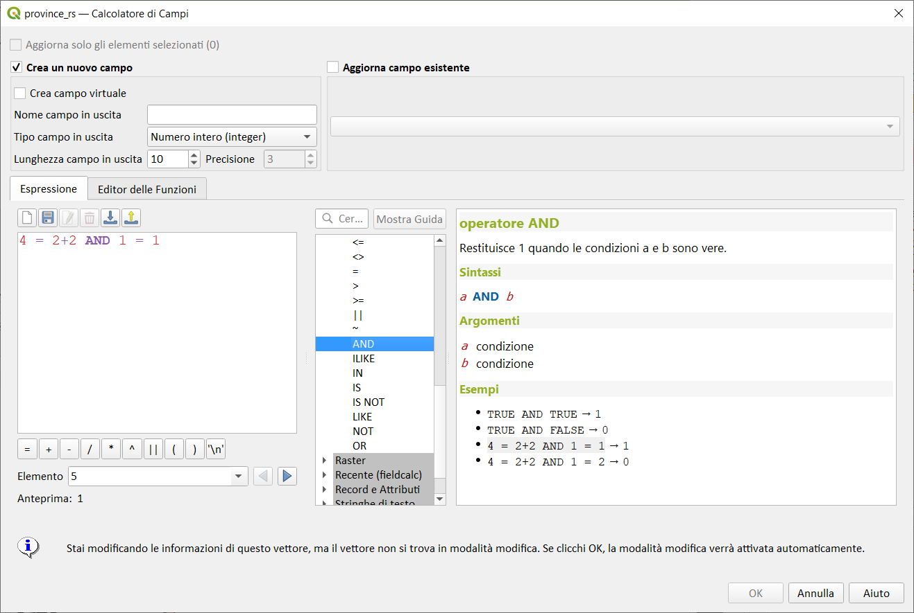
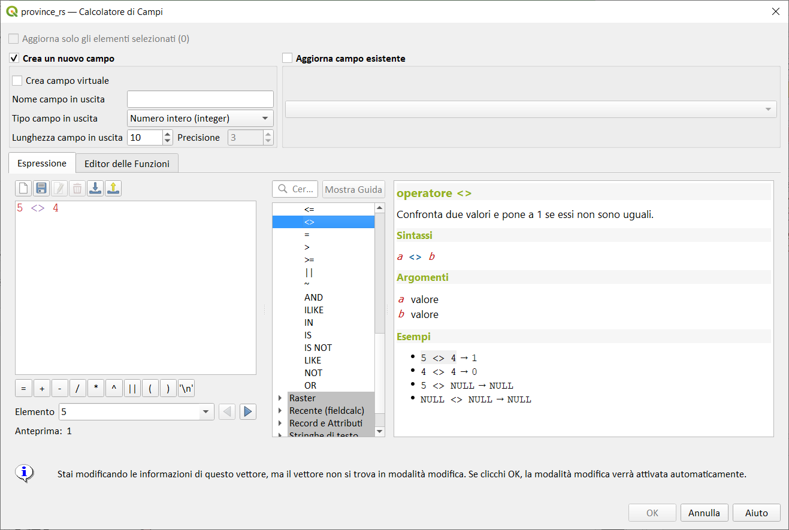
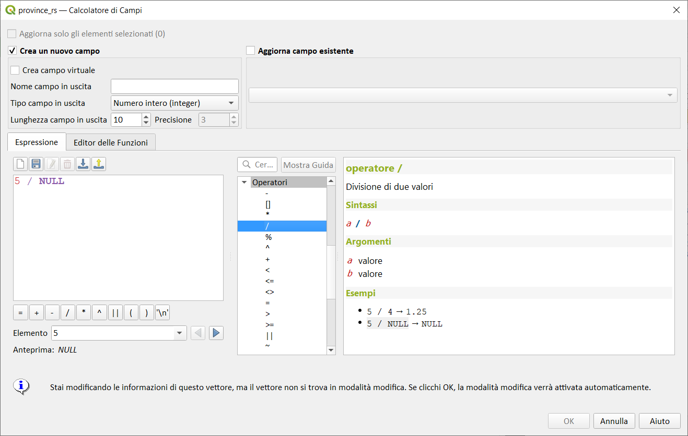
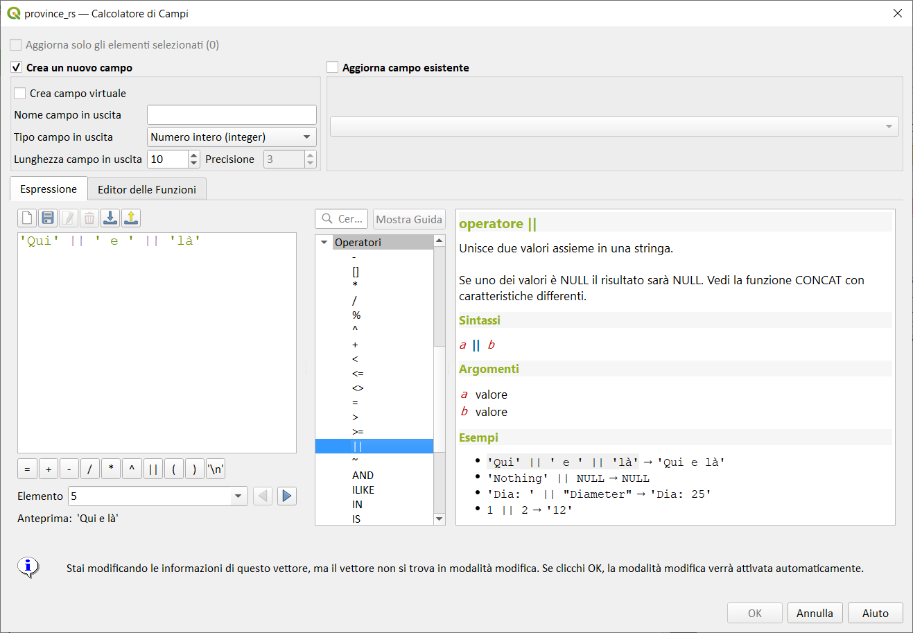
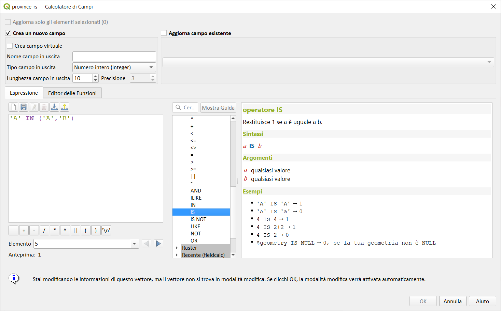
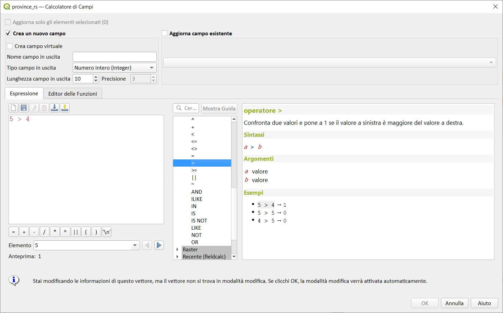
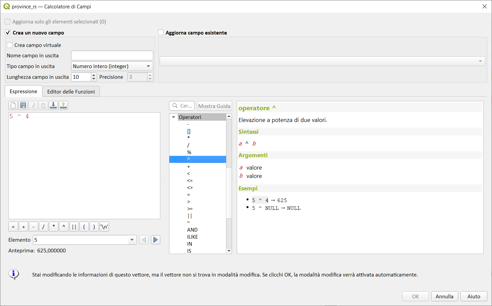
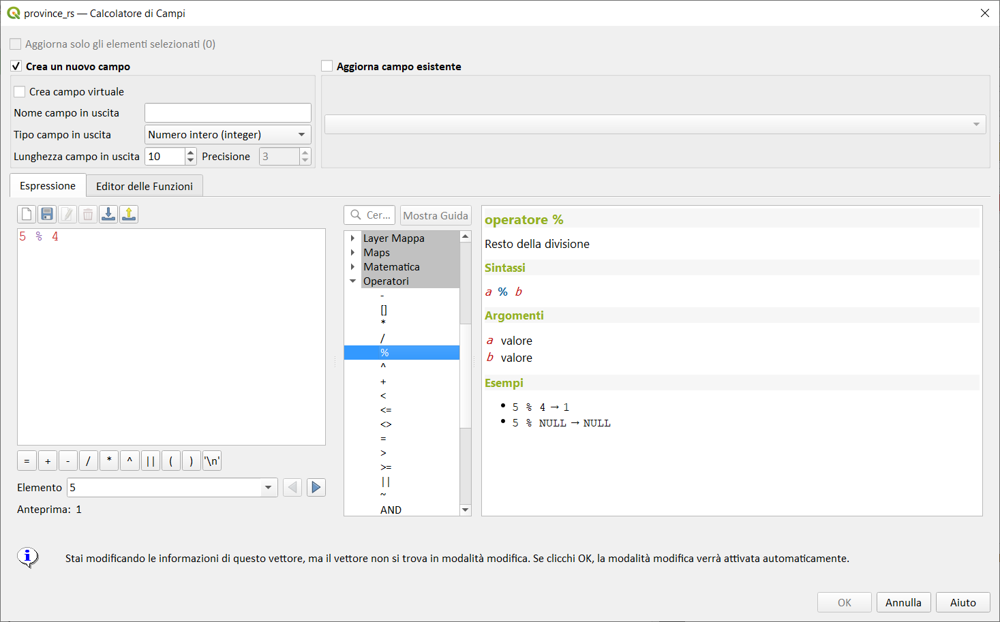
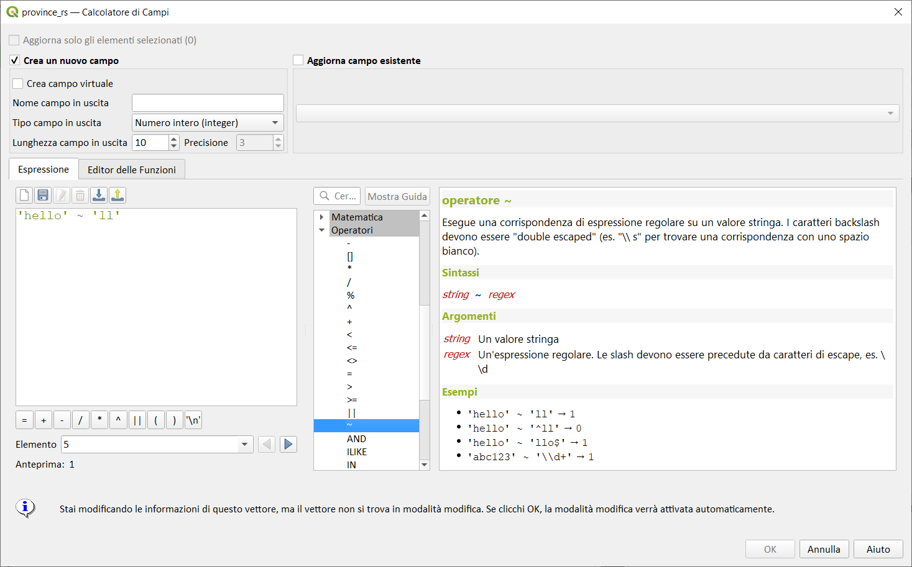

Gruppo Operatori

!!! Abstract
    **Questo gruppo contiene operatori es. + - ***

---

## AND

Restituisce 1 quando le condizioni a e b sono vere.

Esempi:

```
TRUE AND TRUE → 1
TRUE AND FALSE → 0
4 = 2+2 AND 1 = 1 → 1
4 = 2+2 AND 1 = 2 → 0
```

Osservazioni:

1 significa **Vero**

0 significa **falso**



---

# <>

Confronta due valori e pone a 1 se essi non sono uguali.

Esempi:

```
5 <> 4 → 1
4 <> 4 → 0
5 <> NULL → NULL
NULL <> NULL → NULL
```

Osservazioni:

1 significa **Vero**

0 significa **falso**



---

# Operatore / (divisione)

Divisione di due valori.

Esempi:

```
5 / 4 → 1.25
5 / NULL → NULL
NULL / 5 → NULL
```



---

# ||

Unisce due valori assieme in una stringa.
Se uno dei valori è NULL il risultato sarà NULL. Vedi la funzione CONCAT con caratteristiche differenti.

Esempi:

```
'Qui' || ' e ' || 'là' → 'Qui e là'
'Nothing' || NULL → NULL
'Dia: ' || "Diameter" → 'Dia: 25' ("Diameter" - un campo tabella attributi)
1 || 2 → '12'
```

Osservazioni:

Puoi concatenare stringhe usando `||` o `+`. Quest'ultimo significa anche somma nelle espressioni. Quindi se hai un intero (campo o valore numerico) questo può essere soggetto a errori. In questo caso, dovresti usare `||`. Se si concatenano due valori stringa, è possibile utilizzare entrambi.



---

# ILIKE

Restituisce 1 se il primo parametro soddisfa senza tener conto delle maiuscole o minuscole il modello fornito. LIKE può essere usato al posto di ILIKE per eseguire una comparazione che tenga conto delle maiuscole e minuscole. Funziona anche con i numeri.

Esempi:

```
'A' ILIKE 'A' → 1
'A' ILIKE 'a' → 1
'A' ILIKE 'B' → 0
'ABC' ILIKE 'b' → 0
'ABC' ILIKE 'B' → 0
'ABC' ILIKE '_b_' → 1
'ABC' ILIKE '_B_' → 1
'ABCD' ILIKE '_b_' → 0
'ABCD' ILIKE '_B_' → 0
'ABCD' ILIKE '_b%' → 1
'ABCD' ILIKE '_B%' → 1
'ABCD' ILIKE '%b%' → 1
'ABCD' ILIKE '%B%' → 1
```

Osservazioni:

1 significa **Vero**

0 significa **falso**


---

# Operatore IN

Restituisce 1 se il valore viene trovato in una lista di valori.

Esempi:

```
'A' IN ('A','B') → 1
'A' IN ('C','B') → 0
```

Osservazioni:

La funzione distingue maiuscolo dal minuscolo!!!

1 significa **Vero**

0 significa **falso**


---

# IS

Restituisce 1 se _a_ è uguale a _b_.

Esempi:

```
'A' IS 'A' → 1
*'A' IS 'a' → 0
4 IS 4 → 1
4 IS 2+2 → 1
4 IS 2 → 0
$geometry IS NULL → 0, se la tua geometria non è NULL
```

Osservazioni:

La funzione distingue maiuscolo dal minuscolo!!!

1 significa **Vero**

0 significa **falso**

## Is Not

## LIKE

Restituisce 1 se il primo parametro soddisfa il modello fornito. Funziona anche con i numeri.

Esempi:

```
'A' LIKE 'A' → 1
'A' LIKE 'a' → 0
'A' LIKE 'B' → 0
'ABC' LIKE 'B' → 0
'ABC' LIKE '_B_' → 1
'ABCD' LIKE '_B_' → 0
'ABCD' LIKE '_B%' → 1
'ABCD' LIKE '%B%' → 1
'1%' LIKE '1\%' → 1
'1_' LIKE '1\%' → 0
```

Osservazioni:

La funzione distingue maiuscolo dal minuscolo!!!

1 significa **Vero**

0 significa **falso**


---

# >

Confronta due valori e pone a 1 se il valore a sinistra è maggiore del valore a destra.

Esempi:

```
5 > 4 → 1
5 > 5 → 0
4 > 5 → 0
```

Osservazioni:

1 significa **Vero**

0 significa **falso**



---

# >=

Confronta due valori e pone a 1 se il valore a sinistra è maggiore o uguale del valore a destra.

Esempi:

```
5 >= 4 → 1
5 >= 5 → 1
4 >= 5 → 0
```

Osservazioni:

1 significa **Vero**

0 significa **falso**

# Operatore - (meno)

Sottrazione di due valori. Se uno dei due valori è NULL il risultato sarà NULL.

Esempi:

```
5 - 4 → 1
5 - NULL → NULL
NULL - 5 → NULL
4 - 5 → -1
```


---

# <

Confronta due valori e pone a 1 se il valore a sinistra è minore del valore a destra.

Esempi:

```
5 < 4 → 0
5 < 5 → 0
4 < 5 → 1
```

Osservazioni:

1 significa **Vero**

0 significa **falso**


---

# Operatore <= (minore uguale)

Confronta due valori e pone a 1 se il valore a sinistra è minore o uguale del valore a destra.

Esempi:

```
5 <= 4 → 0
5 <= 5 → 1
4 <= 5 → 1
```

Osservazioni:

1 significa **Vero**

0 significa **falso**


---

# NOT

Nega una condizione.

Esempi:

```
NOT 1 → 0
NOT 0 → 1
```

Osservazioni:

1 significa **Vero**

0 significa **falso**


---

# OR

Restituisce 1 quando la condizione a oppure b è vera.

Esempi:

```
4 = 2+2 OR 1 = 1 → 1
4 = 2+2 OR 1 = 2 → 1
4 = 2 OR 1 = 2 → 0
```

Osservazioni:

1 significa **Vero**

0 significa **falso**


---


## []Indice operatore. Restituisce un elemento da un array o valore mappa.

Sintassi:

- [] _<span style="color:red;">index</span>_

Argomenti:

- _<span style="color:red;">index</span>_ indice array o valore chiave della mappa

Esempi:

```

array(1,2,3)[0] → 1
array(1,2,3)[2] → 3
array(1,2,3)[-1] → 3
map('a',1,'b',2)['a'] → 1
map('a',1,'b',2)['b'] → 2
```

---

## ^

Elevazione a potenza di due valori.

Sintassi:

- _<span style="color:red;">a</span>_ ^ _<span style="color:red;">b</span>_

Argomenti:

- _<span style="color:red;">a</span>_ valore
- _<span style="color:red;">b</span>_ valore

Esempi:

```
5 ^ 4 → 625
5 ^ NULL → NULL
NULL ^ 5 → NULL
```

Osservazioni:

--



---

# *

Moltiplicazione di due valori.

Esempi:

```
5 * 4 → 20
5 NULL → NULL
NULL 5 → NULL
```


---

# %

Resto della divisione.
In aritmetica il resto è la quantità di *dividendoche è _avanzata_ dalla divisione, cioè quella quantità che non è stata possibile dividere per il divisore affinché il risultato rimanga nell'insieme dei `numeri interi`.
Per definizione: Il resto di una divisione denota la quantità da sottrarre a un dividendo al fine di renderlo divisibile per un divisore.

Esempio:
17 : 2 = 8 resto 1

Sottraendo a 17 il resto di 1 si ottiene 16, numero divisibile per due (la cui metà è 8). Nella divisione tra 17 e 2, va tenuto da parte il resto, ossia quel numero che, se diviso, farebbe rientrare il risultato in un altro insieme numerico.

Il resto di una divisione denota la quantità da sottrarre a un dividendo al fine di renderlo
divisibile per un divisore.

Esempi:

```
5 % 4 → 1
5 % NULL → NULL
NULL % 5 → NULL
```



Altri esempi:

Un esempio molto utile nel campo GIS riguarda l'etichettatura curve di livello: supponiamo di voler etichettare le curve di livello (con passo 50 m) e visualizzare solo le etichette con passo 200 m, l'espressione da usare è la seguente:

```
CASE WHEN   ( "ELEV" % 200 )  = 0 THEN  "ELEV"  END
```

ecco il risultato:

PRIMA:


DOPO:


---

# +

Addizione di due valori. Se uno dei due valori è NULL il risultato sarà NULL.

Esempi:

```
5 + 4 → 9
5 + NULL → NULL
```

Osservazioni:

Puoi concatenare stringhe usando `||` o `+`. Quest'ultimo significa anche somma nelle espressioni. Quindi se hai un intero (campo o valore numerico) questo può essere soggetto a errori. In questo caso, dovresti usare `||`. Se si concatenano due valori stringa, è possibile utilizzare entrambi.


---

# Operatore ~ (tilde)

Esegue un'espressione regolare su di una stringa.

Esempi:

```
'hello' ~ 'll' → 1
'hello' ~ '^ll' → 0
'hello' ~ 'llo$' → 1
```



---

# =

Confronta due valori e pone a 1 se essi sono uguali.

Esempi:

```
5 = 4 → 0
4 = 4 → 1
5 = NULL → NULL
NULL = NULL → NULL
```

Osservazioni:

1 significa **Vero**

0 significa **falso**

