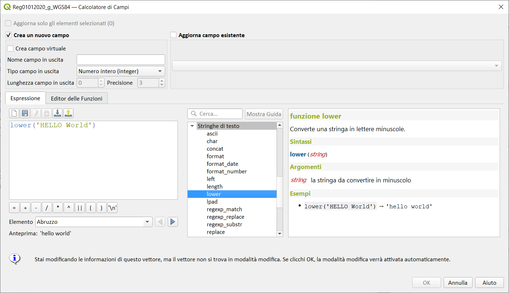

# lower

Converte una stringa in lettere minuscole.

## Sintassi

lower(_string_)

## Argomenti

* _string_ la stringa da convertire in minuscolo

## Esempi

* `lower('HELLO World') → 'hello world'`

## nota bene

--

## osservazioni

--
