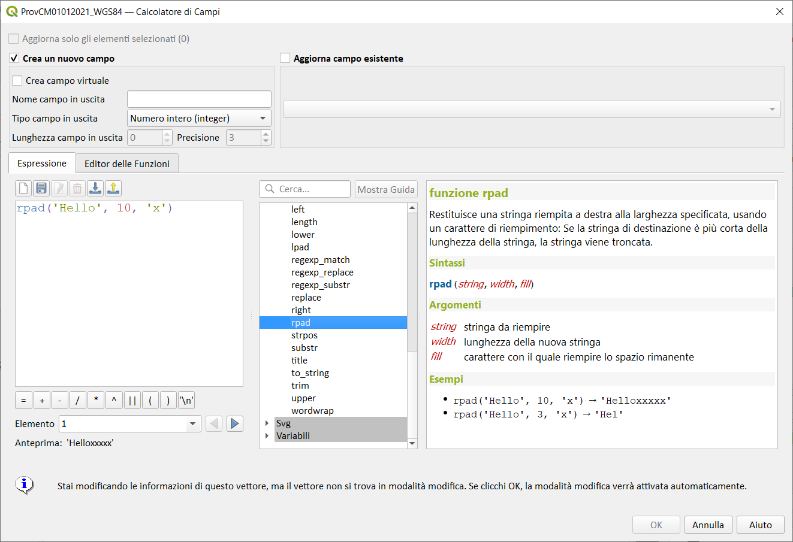

# rpad

Restituisce una stringa riempita a destra della larghezza specificata, utilizzando un carattere di riempimento. Se la larghezza della destinazione è inferiore alla lunghezza della stringa, la stringa viene troncata.

## Sintassi

rpad(_string, width, fill_)

## Argomenti

* _string_ stringa da riempire
* _width_ lunghezza della nuova stringa
* _fill_ carattere con il quale riempire lo spazio rimanente

## Esempi

* `rpad('Hello', 10, 'x') → 'Helloxxxxx'`
* `rpad('Hello', 3, 'x') → 'Hel'`

## nota bene

--

## osservazioni

--
