# Gruppo Stringhe di Testo

!!! Abstract
    **Questo gruppo contiene le funzioni che operano sulle stringhe es. sostituzione, conversione in maiuscolo.**

---

## ascii

Restituisce il codice unicode associato al primo carattere di una stringa.

Sintassi:

- ascii(_<span style="color:red;">string</span>_)

Argomenti:

* _<span style="color:red;">string</span>_ la stringa da convertire in codice unicode

Esempi:

```
ascii('Q') → 81
```

[](../../img/stringhe_di_testo/ascii/ascii1.png)

---

## char

Restituisce il carattere associato ad un codice unicode.

Sintassi:

- char(_<span style="color:red;">code</span>_)

Argomenti:

* _<span style="color:red;">code</span>_ un numero codice unicode

Esempi:

```
char(81) → 'Q'
```

[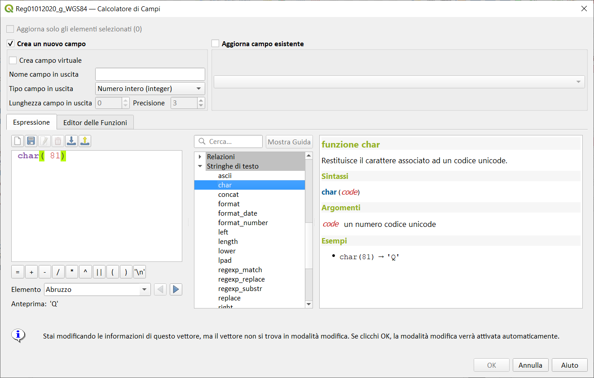](../../img/stringhe_di_testo/char/char1.png)

---

## concat

Concatena svariate stringhe in una sola. Valori NULL sono convertiti in stringhe vuote. Altri valori (come i numeri) sono convertiti in stringa.

Sintassi:

- concat(_<span style="color:red;">string1</span>, <span style="color:red;">string2</span>, …_)

Argomenti:

* _<span style="color:red;">string</span>_ un valore stringa

Esempi:

```
concat('To', 'tò') → 'Totò'
concat('a','b','c','d','e') → 'abcde'
concat('Anno ', 2018) → 'Anno 2018'
concat('QGIS 3.0', NULL) → 'QGIS 3.0'
```

[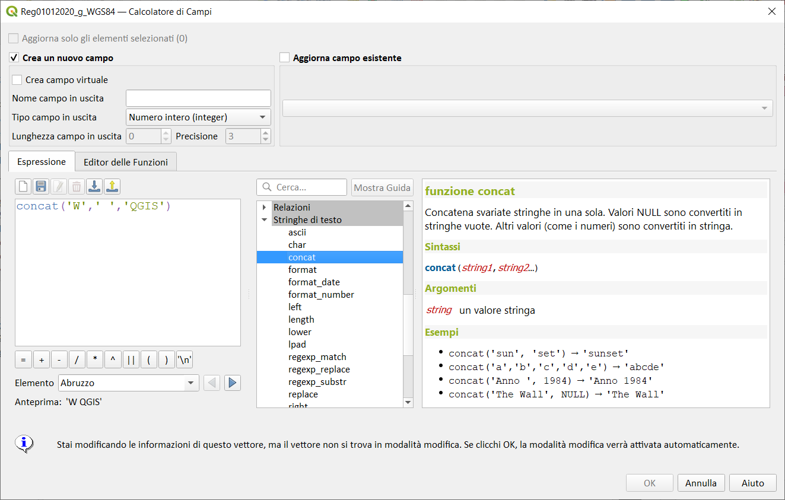](../../img/stringhe_di_testo/concat/concat1.png)

---

## format

Formatta una stringa usando gli argomenti forniti.

Sintassi:

- format(_<span style="color:red;">string</span>, <span style="color:red;">arg1</span>, <span style="color:red;">arg2</span>, <span style="color:red;">…</span>_)

Argomenti:

* _<span style="color:red;">string</span>_ Una stringa con segnaposto %1, %2 e così via per gli argomenti. I segnaposto possono essere ripetuti. Il segnaposto con il numero più basso viene sostituito da arg1, il successivo da arg2, ecc.
* _<span style="color:red;">arg</span>_ Qualsiasi tipo. Qualsiasi numero di argomenti.

Esempi:

```
format('This %1 a %2','is', 'test') → 'Questo è un test'
format('This is %2','a bit unexpected but 2 is lowest number in string','normal') → 'This is a bit unexpected but 2 is lowest number in string'
```

[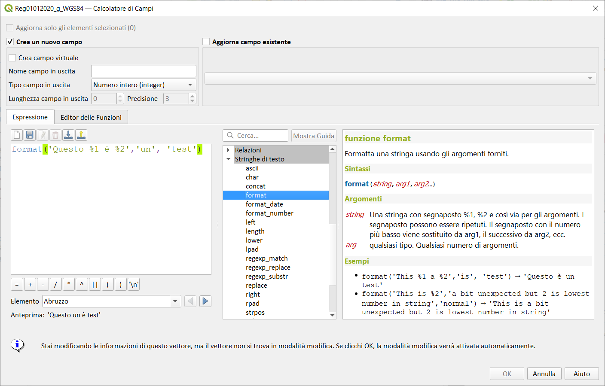](../../img/stringhe_di_testo/format/format1.png)

---

## format_date

Formatta una data o una stringa in un formato stringa personalizzato. Usa le Qt date/time format strings. Vedi [QDateTime::toString](https://doc.qt.io/qt-5/qdatetime.html#toString).

Sintassi:

- Format_date(_<span style="color:red;">datetime</span>, <span style="color:red;">format</span>[,<span style="color:red;">language</span>]_)

Argomenti:

* _<span style="color:red;">datetime</span>_ valora data, ora, o data/ora
* _<span style="color:red;">format</span>_ Modello di stringhe usato per formattare la stringa.


Espressione| Risultato
:----------|:-------
d|il giorno in numero senza lo zero iniziale (da 1 a 31)
dd|il giorno in numero con lo zero iniziale (da 01 a 31)
ddd|il nome locale del giorno abbreviato (es. da 'Mon' a 'Sun')
dddd|il nome locale del giorno per esteso (es. da 'Monday' a 'Sunday')
M|il mese in numero senza lo zero iniziale (1-12)
MM|il mese in numero con lo zero iniziale (01-12)
MMM|il nome locale del mese abbreviato (es. da 'Jan' a 'Dec')
MMMM|il nome locale del mese per esteso (es. da 'January' a 'December')
yy|l'anno come un numero a due cifre (00-99)
yyyy|l'anno come un numero a quattro cifre


Queste espressioni possono essere usate per la parte time della stringa da formattare:


Espressione| Risultato
:----------|:--------
h|l'ora senza lo zero iniziale (da 0 a 23 o da 1 a 12 se visualizzi AM/PM)
hh|l'ora con lo zero iniziale (da 00 a 23 o da 01 a 12 se visualizzi AM/PM)
H|l'ora senza lo zero iniziale (da 0 a 23, anche se visualizzi AM/PM)
HH|l'ora con lo zero iniziale (da 00 a 23, anche se visualizzi AM/PM)
m|il minuto senza lo zero iniziale (da 0 a 59)
mm|il minuto con lo zero iniziale (da 00 a 59)
s|il secondo senza lo zero iniziale (da 0 a 59)
ss|il secondo con lo zero iniziale (da 00 a 59)
z|i millisecondi senza gli zeri iniziali (da 0 a 999)
zzz|i millisecondi con gli zeri iniziali (da 000 a 999)
AP o A|interpretato come un orario nel formato AM/PM. AP deve essere "AM" oppure "PM".
ap o a|interpretato come un orario nel formato AM/PM. ap deve essere "am" oppure "pm".

* _<span style="color:red;">language</span>_ lingua (minuscolo, due o tre lettere, [codice lingua ISO 639](https://en.wikipedia.org/wiki/List_of_ISO_639-1_codes)) utilizzata per formattare la data in una stringa personalizzata. Per impostazione predefinita, viene utilizzata la locale dell'utente di QGIS corrente.

Esempi:

```
format_date('2012-05-15','dd.MM.yyyy') → '15.05.2012'
format_date('2012-05-15','d MMMM yyyy','fr') → '15 mai 2012'
format_date('2012-05-15','dddd') → 'Tuesday', se la lingua corrente è una variante inglese
format_date('2012-05-15 13:54:20','dd.MM.yy') → '15.05.12'
format_date('13:54:20','hh:mm AP') → '01:54 PM'
```

[](../../img/stringhe_di_testo/format_date/format_date1.png)

---

## format_number

Restituisce un numero formattato con il separatore locale per le migliaia. Inoltre tronca il numero al numero di posti forniti.

Sintassi:

- format_number(_<span style="color:red;">number</span>[,<span style="color:red;">places</span>][,<span style="color:red;">language</span>]_)

[ ] indica componenti opzionali

Argomenti:

* _<span style="color:red;">number</span>_ numero da formattare
* _<span style="color:red;">places</span>_ intero rappresentante il numero di posizioni decimali a cui troncare la stringa.
* _<span style="color:red;">language</span>_ lingua (minuscolo, due o tre lettere, [codice lingua ISO 639](https://en.wikipedia.org/wiki/List_of_ISO_639-1_codes)) utilizzata per formattare il numero in una stringa. Per impostazione predefinita, viene utilizzata la locale dell'utente di QGIS corrente.

Esempi:

```
format_number(10000000.332,2) → '10,000,000.33' se ad es. la locale corrente è una variante inglese
format_number(10000000.332,2,'fr') → '10 000 000,33'
```

[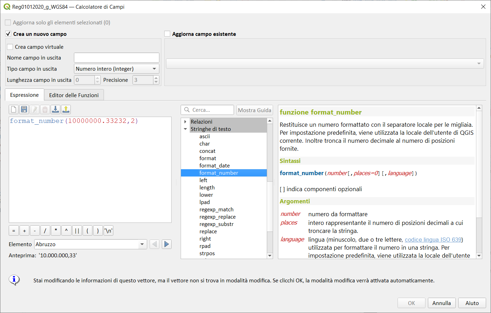](../../img/stringhe_di_testo/format_number/format_number1.png)

---

## left

Restituisce una sottostringa che contiene gli n caratteri più a sinistra della stringa.

Sintassi:

- left(_<span style="color:red;">string</span>, <span style="color:red;">length</span>_)

Argomenti:

* _<span style="color:red;">string</span>_ una stringa
* _<span style="color:red;">length</span>_ intero. Il numero di caratteri da estrarre dalla parte sinistra della stringa.

Esempi:

```
left('Hello World',5) → 'Hello'
```

[](../../img/stringhe_di_testo/left/left1.png)

---

## length

Restituisce il numero di caratteri in una stringa o la lunghezza di una geometria di tipo linestring.

### Variabile stringa

Restituisce il numero di caratteri contenuti in una stringa.

Sintassi:

- length(_<span style="color:red;">string</span>_)

Argomenti:

* _<span style="color:red;">string</span>_ stringa della quale calcolare la lunghezza

Esempi:

```
length('hello') → 5
```

[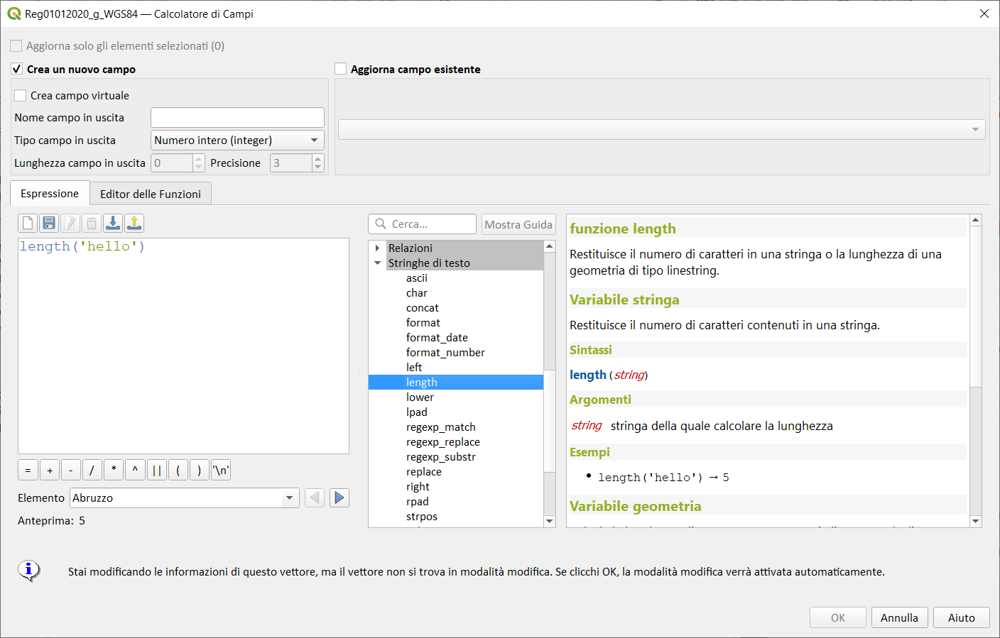](../../img/stringhe_di_testo/length/length1.png)

### Variabile geometria

Calcola la lunghezza di un oggetto a geometria lineare. I calcoli sono sempre planimetrici nel Sistema di Riferimento Spaziale (SR) di detta geometria, e l'unità di misura della lunghezza restituita è conforme all'unità di misura del SR. Ciò differisce dal calcolo eseguito dalla funzione $length, la quale esegue calcoli ellissoidici basati sull'ellissoide del progetto e sulle impostazioni delle unità di distanza.

Sintassi:

- length(_<span style="color:red;">geometry</span>_)

Argomenti:

* _<span style="color:red;">geometry</span>_ oggetto geometria linea

Esempi:

```
length(geom_from_wkt('LINESTRING(0 0, 4 0)')) → 4
```

[](../../img/stringhe_di_testo/length/length2.png)

---

## lower

Converte una stringa in lettere minuscole.

Sintassi:

- lower(_<span style="color:red;">string</span>_)

Argomenti:

* _<span style="color:red;">string</span>_ la stringa da convertire in minuscolo

Esempi:

```
lower('HELLO World') → 'hello world'
```

[](../../img/stringhe_di_testo/lower/lower1.png)

---

## lpad

Restituisce una stringa riempita a sinistra fino alla larghezza specificata, utilizzando un carattere di riempimento. Se la larghezza della destinazione è inferiore alla lunghezza della stringa, la stringa viene troncata.

Sintassi:

- lpad(_<span style="color:red;">string</span>, <span style="color:red;">width</span>, <span style="color:red;">fill</span>_)

Argomenti:

* _<span style="color:red;">string</span>_ stringa da riempire
* _<span style="color:red;">width</span>_ lunghezza della nuova stringa
* _<span style="color:red;">fill</span>_ carattere con il quale riempire lo spazio rimanente

Esempi:

```
lpad('Hello', 10, 'x') → 'xxxxxHello'
lpad('Hello', 3, 'x') → 'Hel'
```

[](../../img/stringhe_di_testo/lpad/lpad1.png)

### Altri esempi utili

se volessi popolare un campo in modo da ottenere segnale01.png, segnale02.png...segnale99.png

id|path
--|---
10|segnale01.png
15|segnale02.png
22|segnale03.png
..|..
520|segnale99.png

espressione utilizzata:

```
'segnale' || lpad( @row_number ,2, '00' )|| '.png' → 'segnale01.png'
```

[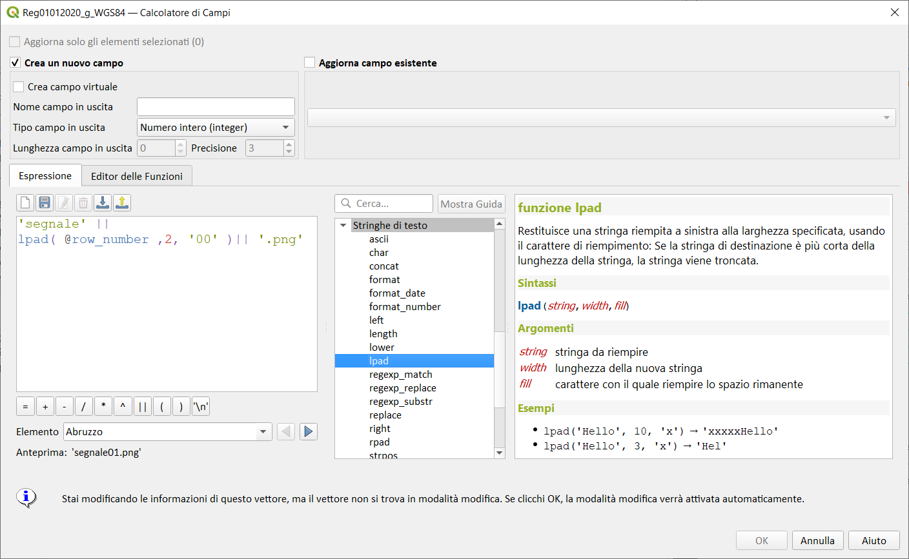](../../img/stringhe_di_testo/lpad/lpad2.png)

--

per ricostruire un identificativo univoco `CODICE_ASC`

CODICE_STR|NUM_CIV|BARRATO|CODICE_ASC
----------|-------|-------|-------
000020|1||0000002000001
000575|1||0000057500001
001785|1|1|00001785000011
005495|38|1|00005495000381
001480|572|10|000014800057210
000150|1||0000015000001

```
lpad("CODICE_STR",8,0)||
lpad( "NUM_CIV",5,0) ||
coalesce("BARRATO",'')
```

[](../../img/stringhe_di_testo/lpad/lpad3.png)

---

## regexp_match

Restituisce la prima posizione di corrispondenza che soddisfa un'espressione regolare all'interno di una stringa, o 0 se la sottostringa non viene trovata.

Sintassi:

- regexp_match(_<span style="color:red;">input_string</span>, <span style="color:red;">regex</span>_)

Argomenti:

* _<span style="color:red;">input_string</span>_ la stringa da confrontare con l'espressione regolare
* _<span style="color:red;">regex</span>_ L'espressione regolare da confrontare. I caratteri backslash (\\) devono essere doppiamente escaped (es "\\s" per selezionare un carattere spazio bianco).

Esempi:

```
regexp_match('QGIS ROCKS','\\sROCKS') → 5
regexp_match('Budač','udač\\b') → 2
```

[](../../img/stringhe_di_testo/regexp_match/regexp_match1.png)

Osservazioni:

[link Wikipedia](https://it.wikipedia.org/wiki/Espressione_regolare#Impiego_delle_espressioni_regolari)

* ^ «apice» ha due significati: se messo all’inizio della regex impone che la linea cominci con quello che segue l’apice; se usato con le parentesi quadre e messo prima di un carattere significa: tranne il carattere che segue, è una negazione
* $ «dollar » se messa alla fine della regex impone che la linea finisca con quello che precede il dollaro
* . «punto» qualunque carattere
* \* «asterisco» accetta zero o più ripetizioni del carattere precedente
* \+ «più» accetta una o più ripetizioni del carattere precedente
* `[ ]` «parentesi quadre» tutti i caratteri all’interno delle [ ] sono accettati: le due parentesi si comportano come un singolo carattere
* `[^ ]` «parentesi quadre con apice» tutti i caratteri tranne quelli all’interno delle [ ] sono accettati
* / «slash» inizia/termina l’espressione regolare
* \ «barra rovesciata» tratta il carattere speciale che segue come un normale carattere testuale o viceversa tratta un normale carattere come un carattere speciale

[link1](https://natonelbronx.wordpress.com/2007/12/02/le-espressioni-regolari-regex-o-regexp/)

[link2](https://www.python.it/doc/howto/Regex/regex-it/regex-it.html)

```
regexp_match('QGIS ROCKS ciao come stai','$') = length ('QGIS ROCKS ciao come stai')+1
```

[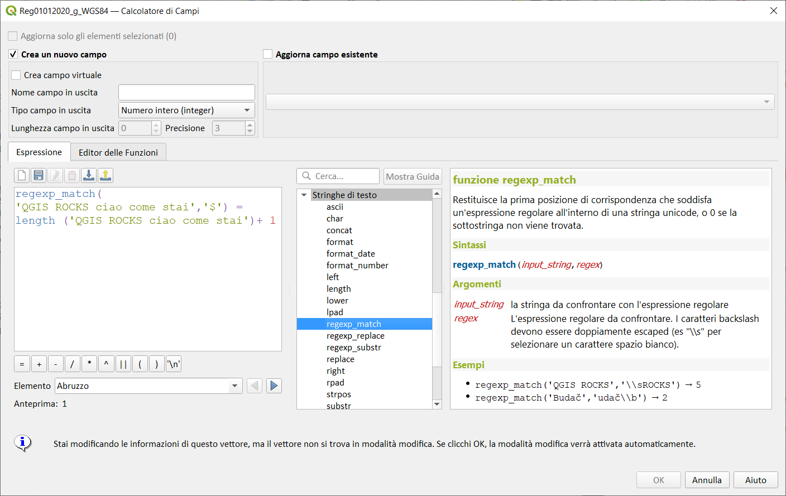](../../img/stringhe_di_testo/regexp_match/regexp_match2.png)

--

### Altri esempi

vedi [qui](https://gist.github.com/pigreco/86589dddf5a59b3a7650267d5af237bd#gistcomment-3795637)

```
regexp_matches( "catasto" ,'^(.+)\\.(.+)\\.(.+)\\.(.+)_(.+)\\.(.+)$')[x]

con x che varia da 0 a 5
```

[](https://user-images.githubusercontent.com/7631137/123671871-072f1f00-d83f-11eb-8110-59d82995e69a.png)

---

## regexp_replace

Restituisce una stringa con la parte che soddisfa l'espressione regolare sostituita.

Sintassi:

- regexp_replace(_<span style="color:red;">input_string</span>, <span style="color:red;">regex</span>, <span style="color:red;">replacement</span>_)

Argomenti:

* _<span style="color:red;">input_string</span>_ la stringa in cui sostituire
* _<span style="color:red;">regex</span>_ L'espressione regolare per sostituire. I caratteri backslash devono essere double escaped (es "\\s" per selezionare un carattere spazio bianco).
* _<span style="color:red;">replacement</span>_ La stringa che sostituirà qualsiasi occorrenza corrispondente dell'espressione regolare passata. I gruppi catturati possono essere inseriti nella stringa di sostituzione usando `\\1`, `\\2`, etc.

Esempi:

```
regexp_replace('QGIS SHOULD ROCK','\\sSHOULD\\s',' DOES ') → 'QGIS DOES ROCK'
regexp_replace('ABC123','\\d+','') → 'ABC'
regexp_replace('my name is John','(.*) is (.*)','\\2 is \\1') → 'Il mio nome è Giovanni'
```

[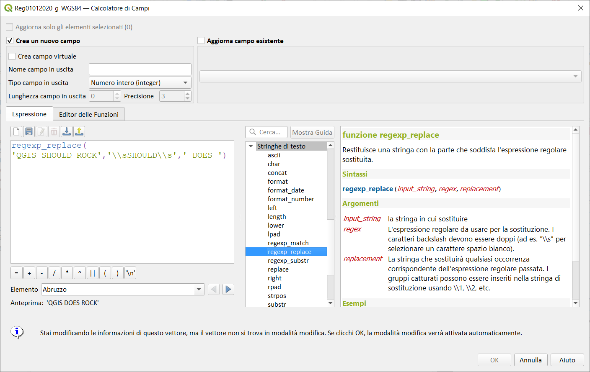](../../img/stringhe_di_testo/regexp_replace/regexp_replace1.png)

Esempi:o 2

Tabella:

id|particella
--|----------
1 |00AXJ
2 |000BBG
3 |0JJU

Aggiornare il campo `particella` togliendo gli zeri iniziali:

espressione da usare:

```
regexp_replace(  "particella" ,'^0+','')`
```

risultato:

id|particella
--|----------
1 |AXJ
2 |BBG
3 |JJU

ecco un tool dove provare le regexp: <https://regex101.com/r/SSDBmj/1>

Esempi:o 3

id | valore
---|------
1  | data20200224
2  | data20200225
3  | data20200226

eliminare data e inserire un simbolo tra anno, mese e giorno

espressione da usare:

```
regexp_replace("valore" ,'(data)(....)(..)(..)','\\2-\\3-\\4')`
```

risultato:

id | valore
---|------
1  | 2020-02-24
2  | 2020-02-25
3  | 2020-02-26

Esempi:o 4

Tabella:

id|particella
--|----------
1 |00AXJ.su
2 |000BBG.cot
3 |0JJU.1234

Aggiornare il campo `particella` togliendo tutto quello dopo il punto (.):

espressione da usare:

```
regexp_replace( 'xxxxx.yyy','\\.(.+)$','')`
```

risultato:

id|particella
--|----------
1 |00AXJ
2 |000BBG
3 |0JJU

[qui](https://gist.github.com/pigreco/86589dddf5a59b3a7650267d5af237bd#gistcomment-3473942) altri esempi

---

## regexp_substr

Restituisce la porzione di una stringa che soddisfa l'espressione regolare passata.

Sintassi:

- regexp_substr(_<span style="color:red;">input_string</span>, <span style="color:red;">regex</span>_)

Argomenti:

* _<span style="color:red;">input_string</span>_ la stringa in cui cercare
* _<span style="color:red;">regex</span>_ L'espressione regolare da contro abbinare. I caratteri backslash devono essere "double escaped" ( es `"\\s"` per selezionare un carattere spazio).

Esempi:

```
regexp_substr('abc123','(\\d+)') → '123'
```

[](../../img/stringhe_di_testo/regexp_substr/regexp_substr1.png)

---

## replace

Restituisce una stringa con la stringa, array o mappa di stringhe passate sostituite.

### Variabile stringa & array

Restituisce una stringa con la stringa o array di stringa passate sostituite da una stringa o un array di stringhe.

Sintassi:

- replace(_<span style="color:red;">string</span>, <span style="color:red;">before</span>, <span style="color:red;">after</span>_)

Argomenti:

* _<span style="color:red;">string</span>_ la stringa in ingresso
* _<span style="color:red;">before</span>_ la stringa o array di stringhe da sostituire
* _<span style="color:red;">after</span>_ la stringa o l'array di stringe da usare come sostituzione

Esempi:

```
replace('QGIS SHOULD ROCK','SHOULD','DOES') → 'QGIS DOES ROCK'
replace('QGIS ABC',array('A','B','C'),array('X','Y','Z')) → 'QGIS XYZ'
replace('QGIS',array('Q','S'),'') → 'GI'
```

[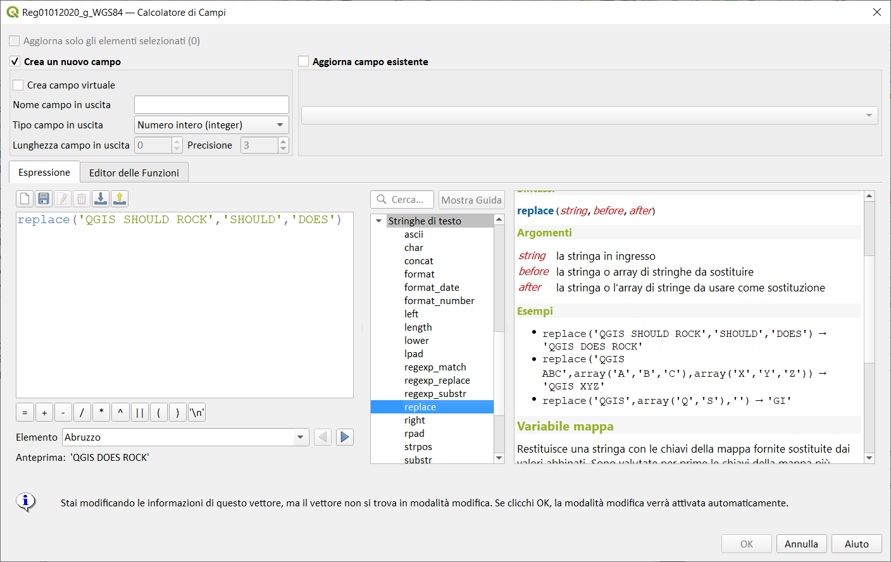](../../img/stringhe_di_testo/replace/replace1.png)

### Variabile mappa

Restituisce una stringa con le chiavi della mappa fornite sostituite dai valori abbinati. Sono valutate per prime le chiavi della mappa più lunghe.

Sintassi:

- replace(_<span style="color:red;">string</span>, <span style="color:red;">map</span>_)

Argomenti:

* _<span style="color:red;">string</span>_ la stringa in ingresso
* _<span style="color:red;">map</span>_ la mappa che contiene le chiavi e i valori

Esempi:

```
replace('APP SHOULD ROCK',map('APP','QGIS','SHOULD','DOES')) → 'QGIS DOES ROCK'
replace('forty two',map('for','4','two','2','forty two','42')) → '42'
```

[](../../img/stringhe_di_testo/replace/replace2.png)

---

## right

Restituisce una sottostringa che contiene gli n caratteri più a destra della stringa.

Sintassi:

- right(_<span style="color:red;">string</span>, <span style="color:red;">length</span>_)

Argomenti:

* _<span style="color:red;">string</span>_ una stringa
* _<span style="color:red;">length</span>_ intero. Il numero di caratteri da estrarre dalla parte destra della stringa.

Esempi:

```
right('Hello World',5) → 'World'
```

[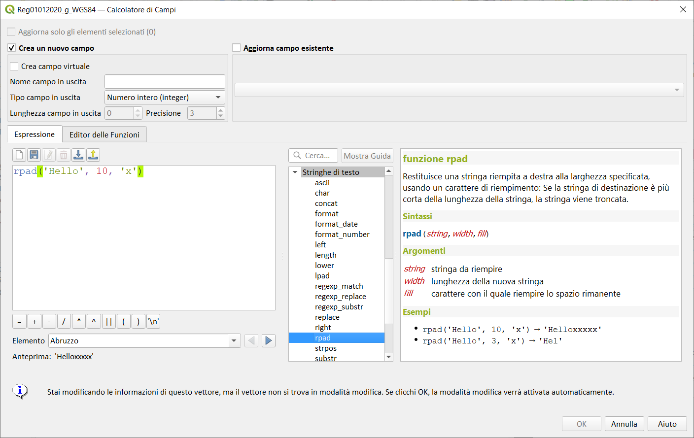](../../img/stringhe_di_testo/right/right1.png)

---

## rpad

Restituisce una stringa riempita a destra della larghezza specificata, utilizzando un carattere di riempimento. Se la larghezza della destinazione è inferiore alla lunghezza della stringa, la stringa viene troncata.

Sintassi:

- rpad(_<span style="color:red;">string</span>, <span style="color:red;">width</span>, <span style="color:red;">fill</span>_)

Argomenti:

* _<span style="color:red;">string</span>_ stringa da riempire
* _<span style="color:red;">width</span>_ lunghezza della nuova stringa
* _<span style="color:red;">fill</span>_ carattere con il quale riempire lo spazio rimanente

Esempi:

```
rpad('Hello', 10, 'x') → 'Helloxxxxx'
rpad('Hello', 3, 'x') → 'Hel'
```

[](../../img/stringhe_di_testo/rpad/rpad1.png)

---

## strpos

Restituisce la prima posizione di corrispondenza di una sottostringa dentro in un'altra stringa o 0 se la sottostringa non viene trovata.

Sintassi:

- strpos(_<span style="color:red;">haystack</span>, <span style="color:red;">needle</span>_)

Argomenti:

* _<span style="color:red;">haystack</span>_ stringa in cui deve essere cercata
* _<span style="color:red;">needle</span>_ stringa da cercare

Esempi:

```
strpos('HELLO WORLD','WORLD') → 7
strpos('HELLO WORLD','GOODBYE') → 0
```

[](../../img/stringhe_di_testo/strpos/strpos1.png)

---

## substr

Restituisce una parte di una stringa.

Sintassi:

- substr(_<span style="color:red;">string</span>, <span style="color:red;">start</span>[, <span style="color:red;">length</span>]_)

[ ] indica componenti opzionali

Argomenti:

* _<span style="color:red;">string</span>_ l'intera stringa in entrata
* _<span style="color:red;">start</span>_ intero rappresentante la posizione di partenza dalla quale estrarre; se il valore di partenza è negativo, la stringa restituita inizierà dalla fine della stringa meno il valore di partenza
* _<span style="color:red;">length</span>_ intero rappresentante la lunghezza della stringa da estrarre; se la lunghezza è negativa, la stringa restituita ometterà la lunghezza data di caratteri dalla fine della stringa

Esempi:

```
substr('HELLO WORLD',3,5) → 'LLO W'
substr('HELLO WORLD',3,5) {6)?} → 'WORLD'
substr('HELLO WORLD',-5) → 'WORLD'
substr('HELLO',3,-1) → 'LL'
substr('HELLO WORLD',-5,2) → 'WO'
substr('HELLO WORLD',-5,-1) → 'WORL'
```

[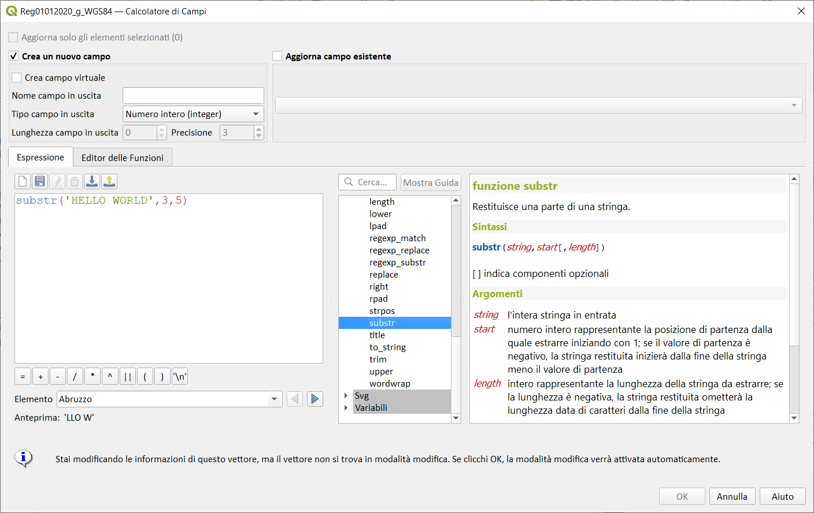](../../img/stringhe_di_testo/substr/substr1.png)

---

## title

Converte tutte le parole in "title case" (tutte le parole in minuscolo con la prima lettera maiuscola)

Sintassi:

- title(_<span style="color:red;">string</span>_)

Argomenti:

* _<span style="color:red;">string</span>_ stringa da convertire in minuscolo con la prima lettera maiuscola

Esempi:

```
title('hello WOrld') → 'Hello World'
```

[](../../img/stringhe_di_testo/title/title1.png)

---

## to_string

Converte un numero in stringa.

Sintassi:

- to_string(_<span style="color:red;">number</span>_)

Argomenti:

* _<span style="color:red;">number</span>_ Valore intero o reale. Il numero da convertire in stringa.

Esempi:

```
to_string(123.23) → '123.23'
```

[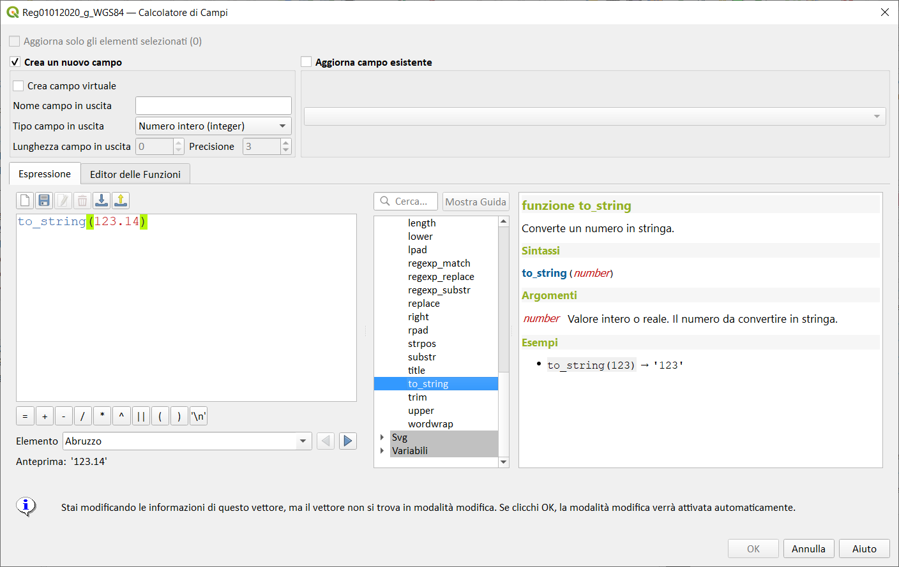](../../img/stringhe_di_testo/to_string/to_string1.png)

---

## trim

Rimuove tutti gli spazi vuoti (spazi, tabulazioni, etc.) all'inizio e alla fine di una stringa.

Sintassi:

- trim(_<span style="color:red;">string</span>_)

Argomenti:

* _<span style="color:red;">string</span>_ stringa da troncare

Esempi:

```
trim(' hello world   ') → 'hello world'
```

[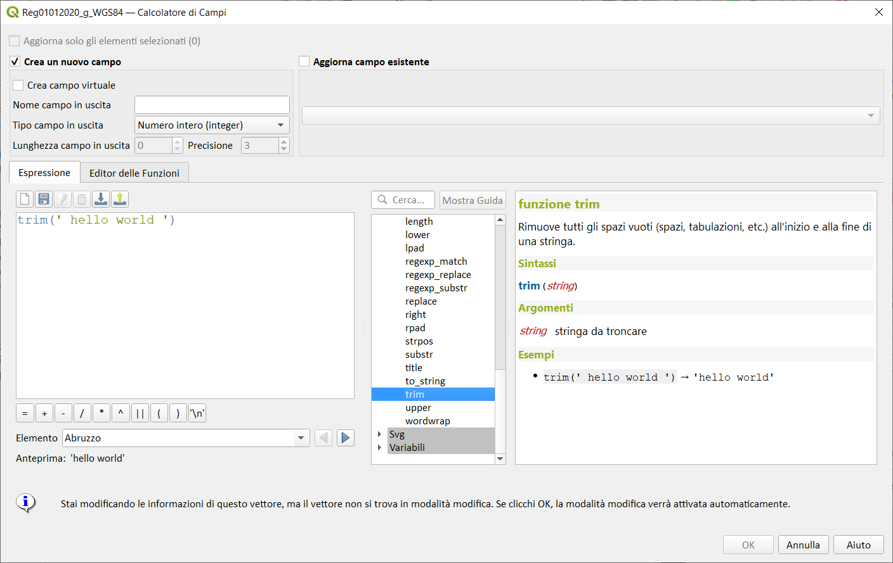](../../img/stringhe_di_testo/trim/trim1.png)

---

## upper

Converte una stringa in lettere maiuscole.

Sintassi:

- upper(_<span style="color:red;">string</span>_)

Argomenti:

* _<span style="color:red;">string</span>_ la stringa da convertire in maiuscolo

Esempi:

```
upper('hello WOrld') → 'HELLO WORLD'
```

[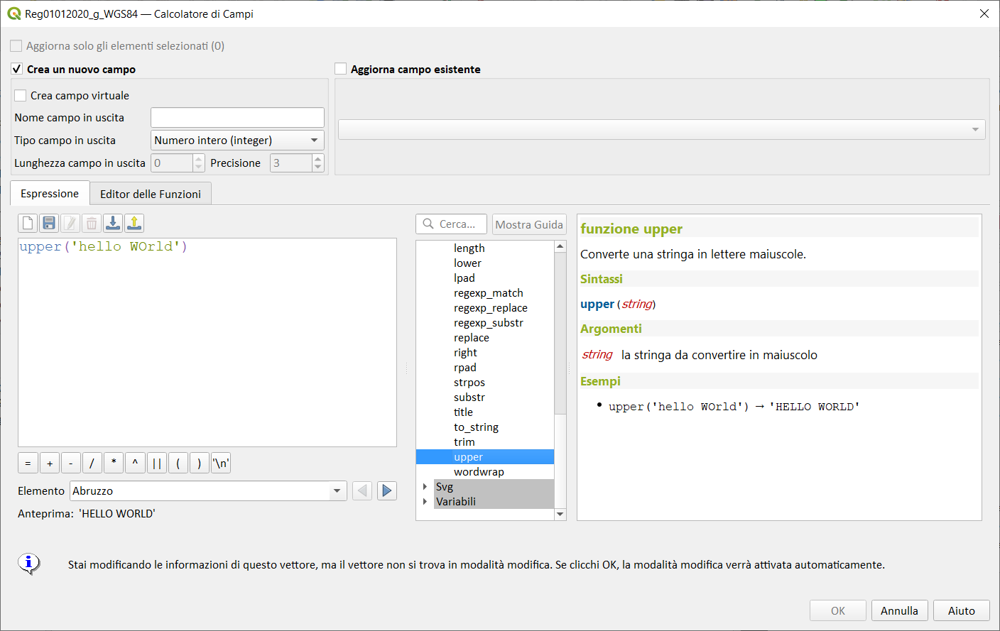](../../img/stringhe_di_testo/upper/upper1.png)

---

## wordwrap

Restituisce una stringa posta a capo ad un massimo/minimo numero di caratteri.

Sintassi:

- wordwrap(_<span style="color:red;">string</span>, <span style="color:red;">wrap_length</span>, <span style="color:red;">delimiter_string</span>_)

Argomenti:

* _<span style="color:red;">string</span>_ la stringa da spezzare
* _<span style="color:red;">wrap_length</span>_ un intero. Se wrap_length è positivo il numero rappresenta il numero massimo ideale di caratteri a cui spezzare; se negativo, il numero rappresenta il numero minimo di caratteri a cui spezzare.
* _<span style="color:red;">delimiter_string</span>_ il delimitatore stringa per spezzare in una nuova linea (opzionale).

Esempi:

```
wordwrap('UNIVERSITY OF QGIS',13) → 'UNIVERSITY OF 
QGIS'
wordwrap('UNIVERSITY OF QGIS',-3) → 'UNIVERSITY OF 
QGIS'
```

[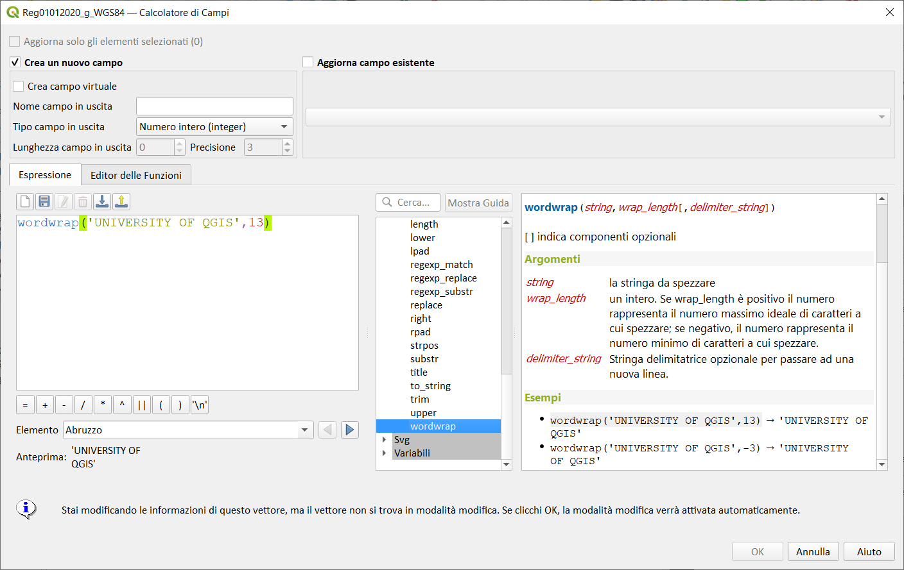](../../img/stringhe_di_testo/wordwrap/wordwrap1.png)

---
