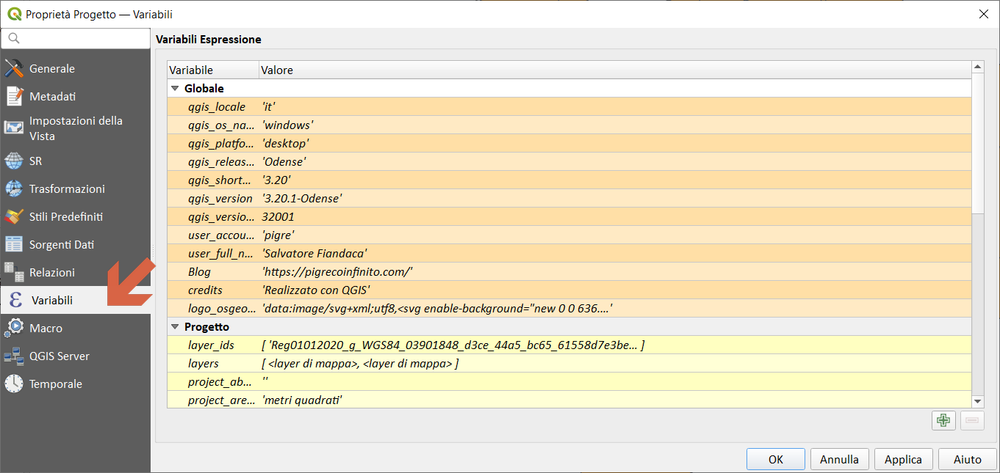
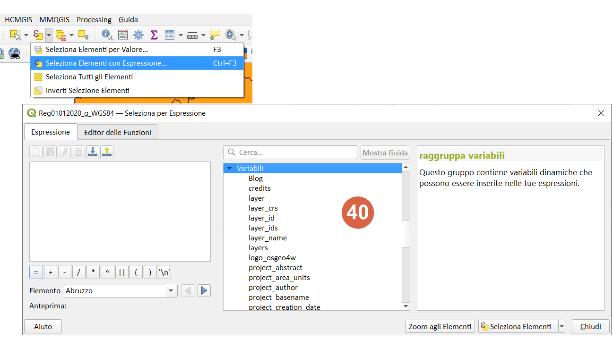
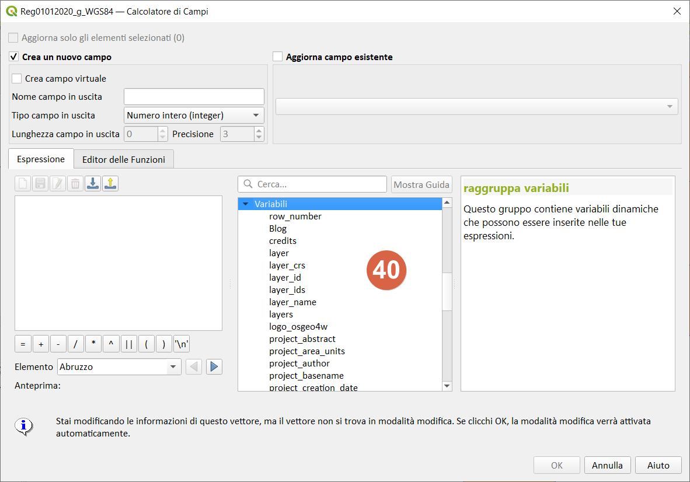
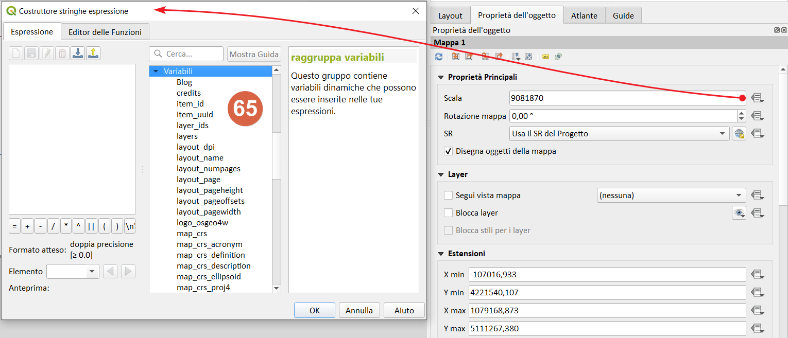

# Variabili

[Funzionalità](http://nyalldawson.net/2015/12/exploring-variables-in-qgis-2-12-part-1/) introdotta da [Nyall Dawson](https://twitter.com/nyalldawson) nella **QGIS 2.12 Lyon**

Questo gruppo contiene variabili dinamiche relative all'applicazione, al file di progetto e ad altre impostazioni. Significa che alcune funzioni potrebbero non essere disponibili in base al contesto:

* seleziona per espressione 
* calcolatore di campi 
* geometry generator 
* proprietà del layer 
* compositore di stampe 

In **QGIS**, puoi utilizzare le variabili per memorizzare dati utili con valori ricorrenti (ad esempio il titolo del progetto o il nome completo dell’utente) che possono essere utilizzati nelle espressioni. Le variabili possono essere definite a **livello globale** dell’**applicazione**, a **livello di progetto**, a **livello di layer**, a **livello di composizione** e a **livello di elemento del compositore**. Proprio come le regole CSS a cascata, le variabili possono essere sovrascritte, ad esempio una variabile a livello di progetto sovrascrive le variabili di livello globale di qualsiasi applicazione impostate con lo stesso nome.

Puoi utilizzare queste variabili per creare stringhe di testo o altre espressioni personalizzate utilizzando il carattere '@' prima del nome della variabile.

Riguardano (aggiornato a QGIS 3.20 Odense):

Variable|Description
--------|-----------
[algorithm_id](algorithm_id.md)|The unique ID of an algorithm
[animation_end_time](animation_end_time.md)|End of the animation’s overall temporal time range (as a datetime value)
[animation_interval](animation_interval.md)|Duration of the animation’s overall temporal time range (as an interval value)
[animation_start_time](animation_start_time.md)|Start of the animation’s overall temporal time range (as a datetime value)
[atlas_feature](atlas_feature.md)|The current atlas feature (as feature object)
[atlas_featureid](atlas_featureid.md)|The current atlas feature ID
[atlas_featurenumber](atlas_featurenumber.md)|The current atlas feature number in the layout
[atlas_filename](atlas_filename.md)|The current atlas file name
[atlas_geometry](atlas_geometry.md)|The current atlas feature geometry
[atlas_layerid](atlas_layerid.md)|The current atlas coverage layer ID
[atlas_layername](atlas_layername.md)|The current atlas coverage layer name
[atlas_pagename](atlas_pagename.md)|The current atlas page name
[atlas_totalfeatures](atlas_totalfeatures.md)|The total number of features in atlas
[canvas_cursor_point](canvas_cursor_point.md)|The last cursor position on the canvas in the project’s geographical coordinates
[cluster_color](cluster_color.md)|The color of symbols within a cluster, or NULL if symbols have mixed colors
[cluster_size](cluster_size.md)|The number of symbols contained within a cluster
[current_feature](current_feature.md)|The feature currently being edited in the attribute form or table row
[current_geometry](current_geometry.md)|The geometry of the feature currently being edited in the form or the table row
[current_parent_feature](current_parent_feature.md)|represents the feature currently being edited in the parent form. Only usable in an embedded form context.
[current_parent_geometry](current_parent_geometry.md)|represents the geometry of the feature currently being edited in the parent form. Only usable in an embedded form context.
[form_mode](form_mode.md)|What the form is used for, like AddFeatureMode, SingleEditMode, MultiEditMode, SearchMode, AggregateSearchMode or IdentifyMode as string.
[frame_duration](frame_duration.md)|Temporal duration of each animation frame (as an interval value)
[frame_number](frame_number.md)|Current frame number during animation playback
[frame_rate](frame_rate.md)|Number of frames per second during animation playback
[fullextent_maxx](fullextent_maxx.md)|Maximum x value from full canvas extent (including all layers)
[fullextent_maxy](fullextent_maxy.md)|Maximum y value from full canvas extent (including all layers)
[fullextent_minx](fullextent_minx.md)|Minimum x value from full canvas extent (including all layers)
[fullextent_miny](fullextent_miny.md)|Minimum y value from full canvas extent (including all layers)
[geometry_part_count](geometry_part_count.md)|The number of parts in rendered feature’s geometry
[geometry_part_num](geometry_part_num.md)|The current geometry part number for feature being rendered
[geometry_point_count](geometry_point_count.md)|The number of points in the rendered geometry’s part
[geometry_point_num](geometry_point_num.md)|The current point number in the rendered geometry’s part
[geometry_ring_num](geometry_ring_num.md)|Current geometry ring number for feature being rendered (for polygon features only). The exterior ring has a value of 0.
[grid_axis](grid_axis.md)|The current grid annotation axis (eg, ‘x’ for longitude, ‘y’ for latitude)
[grid_number](grid_number.md)|The current grid annotation value
[item_id](item_id.md)|The layout item user ID (not necessarily unique)
[item_uuid](item_uuid.md)|The layout item unique ID
[layer](layer.md)|The current layer
[layer_crs](layer_crs.md)|The Coordinate Reference System Authority ID of the current layer
[layer_id](layer_id.md)|The ID of current layer
[layer_ids](layer_ids.md)|The IDs of all the map layers in the current project as a list
[layer_name](layer_name.md)|The name of current layer
[layers](layers.md)|All the map layers in the current project as a list
[layout_dpi](layout_dpi.md)|The composition resolution (DPI)
[layout_name](layout_name.md)|The layout name
[layout_numpages](layout_numpages.md)|The number of pages in the layout
[layout_page](layout_page.md)|The page number of the current item in the layout
[layout_pageheight](layout_pageheight.md)|The active page height in the layout (in mm for standard paper sizes, or whatever unit was used for custom paper size)
[layout_pageoffsets](layout_pageoffsets.md)|Array of Y coordinate of the top of each page. Allows to dynamically position items on pages in a context where page sizes may change
[layout_pagewidth](layout_pagewidth.md)|The active page width in the layout (in mm for standard paper sizes, or whatever unit was used for custom paper size)
[legend_column_count](legend_column_count.md)|The number of columns in the legend
[legend_filter_by_map](legend_filter_by_map.md)|Indicates if the content of the legend is filtered by the map
[legend_filter_out_atlas](legend_filter_out_atlas.md)|Indicates if the atlas is filtered out of the legend
[legend_split_layers](legend_split_layers.md)|Indicates if layers can be split in the legend
[legend_title](legend_title.md)|The title of the legend
[legend_wrap_string](legend_wrap_string.md)|The character(s) used to wrap the legend text
[map_crs](map_crs.md)|The Coordinate reference system of the current map
[map_crs_acronym](map_crs_acronym.md)|The acronym of the Coordinate reference system of the current map
[map_crs_definition](map_crs_definition.md)|The full definition of the Coordinate reference system of the current map
[map_crs_description](map_crs_description.md)|The name of the Coordinate reference system of the current map
[map_crs_ellipsoid](map_crs_ellipsoid.md)|The acronym of the ellipsoid of the Coordinate reference system of the current map
[map_crs_proj4](map_crs_proj4.md)|The Proj4 definition of the Coordinate reference system of the current map
[map_crs_projection](map_crs_projection.md)|The descriptive name of the projection method used by the Coordinate reference system of the map (e.g. ‘Albers Equal Area’)
[map_crs_wkt](map_crs_wkt.md)|The WKT definition of the Coordinate reference system of the current map
[map_end_time](map_end_time.md)|The end of the map’s temporal time range (as a datetime value)
[map_extent](map_extent.md)|The geometry representing the current extent of the map
[map_extent_center](map_extent_center.md)|The point feature at the center of the map
[map_extent_height](map_extent_height.md)|The current height of the map
[map_extent_width](map_extent_width.md)|The current width of the map
[map_id](map_id.md)|The ID of current map destination. This will be ‘canvas’ for canvas renders, and the item ID for layout map renders
[map_interval](map_interval.md)|The duration of the map’s temporal time range (as an interval value)
[map_layer_ids](map_layer_ids.md)|The list of map layer IDs visible in the map
[map_layers](map_layers.md)|The list of map layers visible in the map
[map_rotation](map_rotation.md)|The current rotation of the map
[map_scale](map_scale.md)|The current scale of the map
[map_start_time](map_start_time.md)|The start of the map’s temporal time range (as a datetime value)
[map_units](map_units.md)|The units of map measurements
[model_path](model_path.md)|Full path (including file name) of current model (or project path if model is embedded in a project).
[model_folder](model_folder.md)|Folder containing current model (or project folder if model is embedded in a project).
[model_name](model_name.md)|Name of current model
[model_group](model_group.md)|Group for current model
[notification_message](notification_message.md)|Content of the notification message sent by the provider (available only for actions triggered by provider notifications).
[parent](parent.md)|Refers to the current feature in the parent layer, providing access to its attributes and geometry when filtering an aggregate function
[project_abstract](project_abstract.md)|The project abstract, taken from project metadata
[project_area_units](project_area_units.md)|The area unit for the current project, used when calculating areas of geometries
[project_author](project_author.md)|The project author, taken from project metadata
[project_basename](project_basename.md)|The basename of current project’s filename (without path and extension)
[project_creation_date](project_creation_date.md)|The project creation date, taken from project metadata
[project_crs](project_crs.md)|The Coordinate reference system of the project
[project_crs_arconym](project_crs_arconym.md)|The acronym of the Coordinate reference system of the project
[project_crs_definition](project_crs_definition.md)|The full definition of the Coordinate reference system of the project
[project_crs_description](project_crs_description.md)|The description of the Coordinate reference system of the project
[project_crs_ellipsoid](project_crs_ellipsoid.md)|The ellipsoid of the Coordinate reference system of the project
[project_crs_proj4](project_crs_proj4.md)|The Proj4 representation of the Coordinate reference system of the project
[project_crs_wkt](project_crs_wkt.md)|The WKT (well known text) representation of the coordinate reference system of the project
[project_distance_units](project_distance_units.md)|The distance unit for the current project, used when calculating lengths of geometries and distances
[project_ellipsoid](project_ellipsoid.md)|The name of the ellipsoid of the current project, used when calculating geodetic areas or lengths of geometries
[project_filename](project_filename.md)|The filename of the current project
[project_folder](project_folder.md)|The folder of the current project
[project_home](project_home.md)|The home path of the current project
[project_identifier](project_identifier.md)|The project identifier, taken from the project’s metadata
[project_keywords](project_keywords.md)|The project keywords, taken from the project’s metadata
[project_last_saved](project_last_saved.md)|Date/time when project was last saved.
[project_path](project_path.md)|The full path (including file name) of the current project
[project_title](project_title.md)|The title of current project
[project_units](project_units.md)|The units of the project’s CRS
[qgis_locale](qgis_locale.md)|The current language of QGIS
[qgis_os_name](qgis_os_name.md)|The current Operating system name, eg ‘windows’, ‘linux’ or ‘osx’
[qgis_platform](qgis_platform.md)|The QGIS platform, eg ‘desktop’ or ‘server’
[qgis_release_name](qgis_release_name.md)|The current QGIS release name
[qgis_short_version](qgis_short_version.md)|The current QGIS version short string
[qgis_version](qgis_version.md)|The current QGIS version string
[qgis_version_no](qgis_version_no.md)|The current QGIS version number
[row_number](row_number.md)|Stores the number of the current row
[snapping_results](snapping_results.md)|Gives access to snapping results while digitizing a feature (only available in add feature)
[scale_value](scale_value.md)|The current scale bar distance value
[symbol_angle](symbol_angle.md)|The angle of the symbol used to render the feature (valid for marker symbols only)
[symbol_color](symbol_color.md)|The color of the symbol used to render the feature
[symbol_count](symbol_count.md)|The number of features represented by the symbol (in the layout legend)
[symbol_id](symbol_id.md)|The Internal ID of the symbol (in the layout legend)
[symbol_label](symbol_label.md)|The label for the symbol (either a user defined label or the default autogenerated label - in the layout legend)
[symbol_layer_count](symbol_layer_count.md)|Total number of symbol layers in the symbol
[symbol_layer_index](symbol_layer_index.md)|Current symbol layer index
[symbol_marker_column](symbol_marker_column.md)|Column number for marker (valid for point pattern fills only).
[symbol_marker_row](symbol_marker_row.md)|Row number for marker (valid for point pattern fills only).
[user_account_name](user_account_name.md)|The current user’s operating system account name
[user_full_name](user_full_name.md)|The current user’s operating system user name
[value](value.md)|The current value
[with_variable](with_variable.md)|Allows setting a variable for usage within an expression and avoid recalculating the same value repeatedly
[zoom_level](zoom_level.md)|Zoom level of the tile that is being rendered (derived from the current map scale). Normally in interval [0, 20].

---

- Proprietà Progetto
- 
- Gruppo sul calcolatore di campi,Seleziona per espressione

- Generatore di geometria- stile 
- 

- Selezione per espressione 
- 

- Calcolatore di campi,Seleziona per espressione 
- 

- Compositore di stampe 
- 
