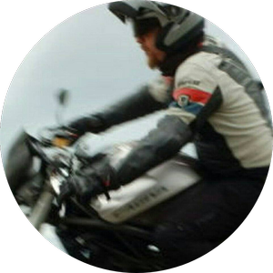

# OpenDataSicilia

 

**OpenDataSicilia** è una iniziativa civica che si propone di far conoscere e diffondere le prassi dell'_open data_ e la cultura dell'_open government_ e nel territorio e aprire una discussione pubblica partecipata. 
È un gruppo di cittadini con diverse storie, competenze, professioni, accomunate dalla volontà di contribuire a migliorare la qualità della vita delle persone, con spirito di collaborazione e concretezza.

## La genesi di questo sito

La forza delle comunità sono le **persone**, le loro **idee**, le **intuizioni**, l'**energia** che hanno dentro e la capacità di **fare insieme tesoro** di tutto questo.

Questa guida nasce da questa frase "buttata" in una chat:

<blockquote>
guardando il video che Totò ha fatto sul suo mega lavoro HfcQGIS mi è sembrato un p&ograve;  scoraggiato, vorrei provare a trasformarlo per lui e dargli molta più visibilità.</blockquote>

Capita spesso, con tutte le buone intenzioni, di scrivere frasi come questa, ma nel 99% dei casi si perdono, senza che ci sia alcuna evoluzione. OpenDataSicilia è un'"**infrastrattura di persone**" dove una bella intenzione - come quella di sopra di Giovan Battista Vitrano - si può trasformare in un passaparola e poi in un progetto; specie quando alle spalle c'è una "[mega lavoro](https://github.com/pigreco/HfcQGIS)" da valorizzare come quello di Salvatore Fiandaca.

<body>
 <link href="../stylesheets/team.css" rel="stylesheet">
  <!-- Team -->
    

      

        

      <!--    <h2 class="section-heading text-uppercase">CHI SIAMO</h2> -->
          <h3 class="section-subheading text-muted">I criceti che hanno fatto girare la ruota.</h3>
        

      

      

        

          

            
            <h4>Andrea Borruso</h4>
            
<a href="https://medium.com/tantotanto" title="Andrea Borruso | tanto tanto Le cose che ci piacciono…" target="_blank">Coordinatore</a>

				

                <a href="https://twitter.com/aborruso" title="Andrea Borruso" target="_blank">
                 
                <i class="fa fa-circle fa-stack-2x"></i>
                <i class="fa fa-twitter fa-stack-1x fa-inverse"></i>
               </a>
				

          

        

        

          

            
            <h4>Salvatore Fiandaca</a></h4>
        
<a href="../autore/" title="Salvatore Fiandaca | Autore e curatore di HfcQGIS" target="_self">Autore e curatore di HfcQGIS</a>
 
			

                <a href="https://twitter.com/totofiandaca" title="Salvatore Fiandaca" target="_blank">
                 
                <i class="fa fa-circle fa-stack-2x"></i>
                <i class="fa fa-twitter fa-stack-1x fa-inverse"></i>
               </a>
				

          

        

        

          

            
            <h4>Giovan Battista Vitrano</h4>
            
<a href="../webmaster/gbvitrano/" title="Giovan Battista Vitrano | Webmaster" target="_self">Webmaster</a>
 
			 
<a href="https://twitter.com/gbvitrano" title="Giovan Battista Vitrano" target="_blank">
                 
                <i class="fa fa-circle fa-stack-2x"></i>
                <i class="fa fa-twitter fa-stack-1x fa-inverse"></i>
              </a>
              

          

        

      

      

        

        

      

    

</body>
## Anagrafica

OpenDataSicilia fa _scruscio_ ("rumore" in siciliano) qui:

<a href="http://twitter.com/opendatasicilia" title="Twitter" target="_blank"><i class="fa fa-twitter-square"></i>&nbsp;&nbsp; Twitter</a> 
<a href="https://t.me/opendatasicilia" title="gruppo Telegram" target="_blank"><i class="fa fa-telegram"></i>&nbsp;&nbsp; Gruppo Telegram</a> 
<a href="https://www.facebook.com/groups/opendatasicilia/" title="gruppo Facebook" target="_blank"><i class="fa fa-facebook-square"></i>&nbsp;&nbsp; Gruppo Facebook</a> 
<a href="https://groups.google.com/forum/#!forum/opendatasicilia/" title="Mailing List" target="_blank"><i class="fa fa-envelope"></i>&nbsp;&nbsp; Mailing List</a> 
<a href="http://opendatasicilia.it" title="opendatasicilia.it" target="_blank"><i class="fa fa-globe"></i>&nbsp;&nbsp; opendatasicilia.it</a> 
