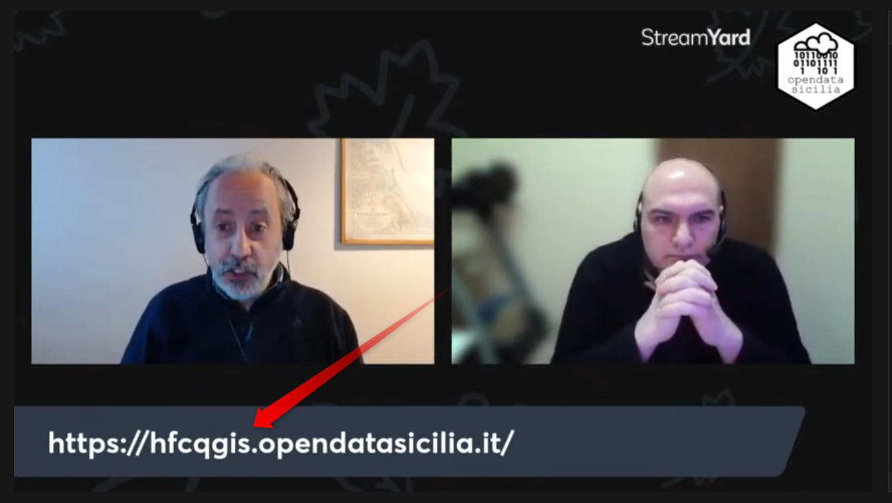
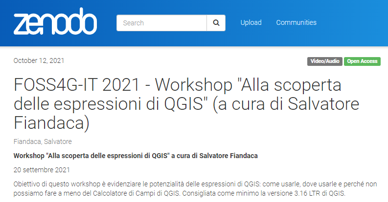
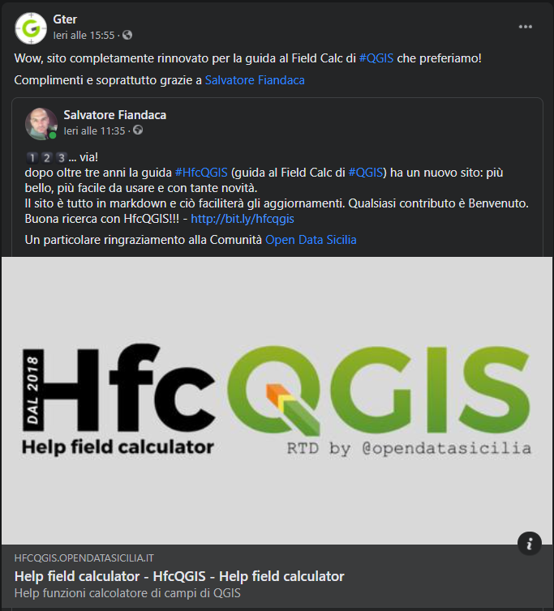

---
tags:
  - news
  - parlano
---

# Parlano di noi

* **21/05/2022** [Andrea Borruso su Twitter](https://twitter.com/aborruso/status/1527957697848561664)

* **11/03/2022** [OpenDataSicilia](https://youtu.be/k1AOK3rz8PQ) by [VisiData-GIS](https://github.com/pigreco/visidata-gis)

* **12/10/2021** [Zenodo](https://zenodo.org/record/5565494) by [FOSS4G-IT 2021](https://foss4g-it2021.gfoss.it/programma.html)

* **06/10/2021** Facebook [GeoBreack 32](https://github.com/pigreco/geobreack_32_by_Gter) by [GTER](https://www.facebook.com/Gteronline/posts/4526778134056595)

* **20/09/2021** FOSS4G-IT 2021 [GFOSS.it](https://foss4g-it2021.gfoss.it/programma.html) by [FOSS4G-IT 2021](https://foss4g-it2021.gfoss.it/index.html)

* **06/06/2021** Facebook [GTer](https://www.facebook.com/Gteronline/posts/4435244053210004) by [GTER](https://www.facebook.com/Gteronline)

* **23/06/2021** Facebook [GeoBreack 28](https://www.facebook.com/Gteronline/posts/4215847015149710) by [GTER](https://www.facebook.com/Gteronline)

* **16/12/2020** YouTube [Presentazione #HfcQGIS in Francia](https://youtu.be/xKoqCZF9NhY) dal minuto 5:07 (Grazie Pier Serafini)

* **16/12/2020** [Twitter](https://twitter.com/geojulien/status/1339131660370108416)

* **01/08/2020** Lista QGIS-it-user [Marco S.](http://osgeo-org.1560.x6.nabble.com/HfcQGIS-e-come-un-coltellino-svizzero-tc5443101.html)

</a>

* **24/06/2020** Facebook [EstateGIS2020](https://www.facebook.com/MasterGIScience/videos/829166000940988/)

</a>

* **06/07/2019** Twitter [Skampus](https://twitter.com/skampus1967/status/1147438041646149632)

</a>

* **29/04/2019** Facebook [GTer](https://www.facebook.com/Gteronline/posts/2295398600527904)

</a>

* **29/04/2019** Twitter [Master GIS Droni](https://twitter.com/MasterGIS_Droni/status/1122765303090425857)

</a>

* **29/04/2019** Facebook [Master in GIScience e droni per la gestione del territorio](https://www.facebook.com/MasterGIScience/posts/2210877379174741)

</a>

* **20/03/2019** Facebook [Risposta ad un post](https://www.facebook.com/groups/GisItalia/permalink/10157247104231385/?comment_id=10157247850806385&reply_comment_id=10157249097251385&comment_tracking=%7B%22tn%22%3A%22R%22%7D)

</a>

* **22/02/2019** Twitter [QGIS México](https://twitter.com/qgismexico/status/1099002315690950656)

</a>

* **22/02/2019** - Twitter [GeObserver](https://twitter.com/geoObserver_/status/1098889290665345026)

</a>

* **14/012/2018** - Twitter [Gter](https://twitter.com/Gteronline/status/1073491660410155008)

</a>

* **01/11/2018** - Facebook [Master in GIScience e droni per la gestione del territorio](https://www.facebook.com/MasterGIScience/posts/2106618966267250)

</a>

* **01/09/2018** - Facebook [openoikos](https://www.facebook.com/openoikos.community/posts/1413337625436036)

</a>

* **25/07/2018** - Facebook [Lezioni GIS](https://www.facebook.com/lezioniGIS/posts/387206891804985)

</a>

* **23/07/2018** - Facebook [QGIS Costa Rica](https://www.facebook.com/QGISCR/posts/2163826227196819)

</a>

* **23/07/2018** - Facebook [QGIS Italia](https://www.facebook.com/qgis.it/posts/1012222122275138)

</a>

* **mag/giu/lug/2018** - GitHub [GitHub](https://github.com/pigreco/HfcQGIS/issues/1)

</a>
