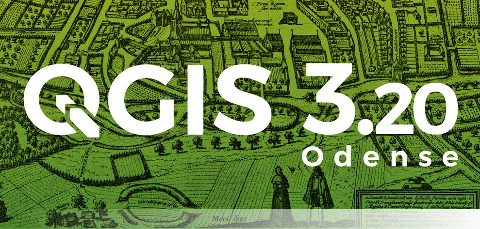
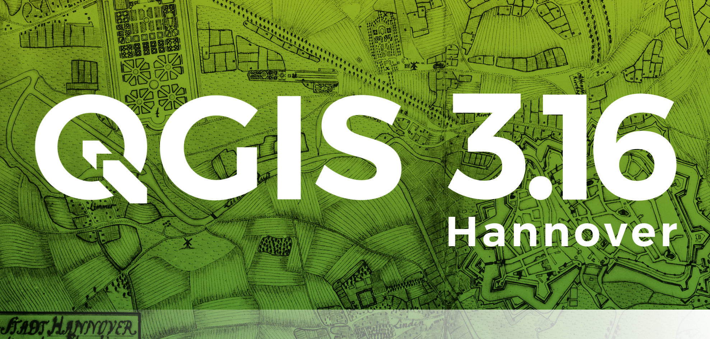

# Novità

!!! Abstract
    **In questa sezione verranno documentate le principali novità implementate nel _calcolatore di campi_ e _tabella degli attributi_, come per esempio nuove funzioni o nuove funzionalità legate alle tabelle.**

---

## Release

Release        | Data | changelog | nuove funzioni
---------------|------|-----------|---------------
[QGIS 3.20 Odense](novita_320.md)  |21/06/2021 |  | length3D, array_count, array_priorize, array_replace, mime_type
[QGIS 3.20 Odense](novita_320.md)  |21/06/2021 |  | UUID, array_get, array_min, arra_max, array_majority, array_sum, array_mean, array_median, map_credits, @layer_crs
[QGIS 3.20 Odense](novita_320.md)  |21/06/2021 |  | main_angle, to_decimal, overlay_*
