# Novità

!!! Abstract
    **In questa sezione verranno documentate le principali novità implementate nel _calcolatore di campi_ e _tabella degli attributi_, come per esempio nuove funzioni o nuove funzionalità legate alle tabelle.**

---

## Release

Release        | Data | changelog | nuove funzioni
---------------|------|-----------|---------------
[QGIS 3.24 Havard](novita_324.md)  |18/02/2022 | <a href="https://changelog.qgis.org/en/qgis/version/3.24/" target="_blank">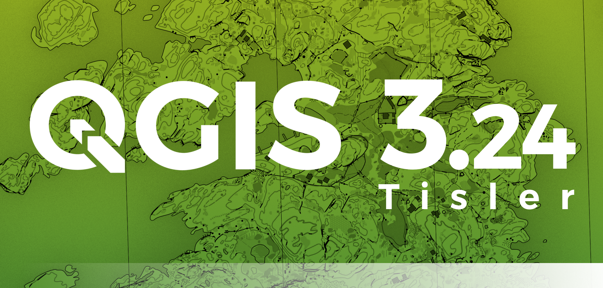</a> | scale, triangular_wave, square_wave, wave, triangular_wave_randomized, square_wave_randomized, wave_randomized, overlay_nearest+, apply_dash_pattern, force_polygon_cw, force_polygon_ccw, densify_by_count, densify_by_distance, roundness, overlay_intersects+, geometry_n+, geometry_type, get_feature+, represent_attributes, array_remove_at, map_prefix_keys, url_encode
[QGIS 3.22 Białowieża](novita_322.md)  |22/10/2021 |  | exif, exif_geotag, sinuosity, $z, affine_transform, straight_distance_2d, vertex_as_point, vertex_z
[QGIS 3.20 Odense](novita_320.md)  |21/06/2021 | <a href="https://www.qgis.org/it/site/forusers/visualchangelog320/index.html" target="_blank">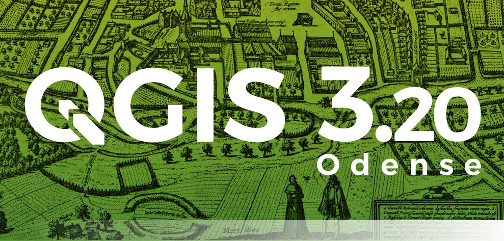</a> | length3D, array_count, array_priorize, array_replace, mime_type
[QGIS 3.18 Zürich](novita_318.md)  |22/02/2021 | <a href="https://www.qgis.org/it/site/forusers/visualchangelog318/index.html" target="_blank">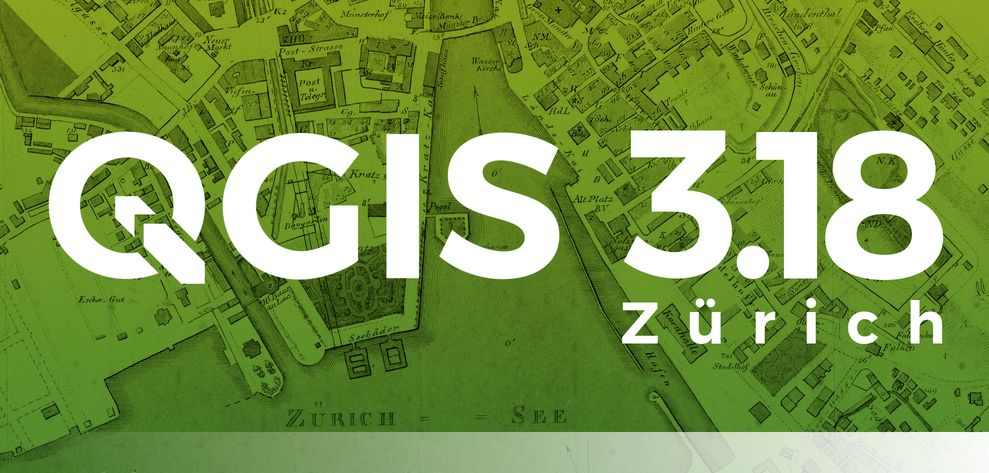</a> | UUID, array_get, array_min, arra_max, array_majority, array_sum, array_mean, array_median, map_credits, @layer_crs
[QGIS 3.16 Hannover](novita_316.md)  |23/10/2020 | <a href="https://www.qgis.org/it/site/forusers/visualchangelog316/index.html" target="_blank">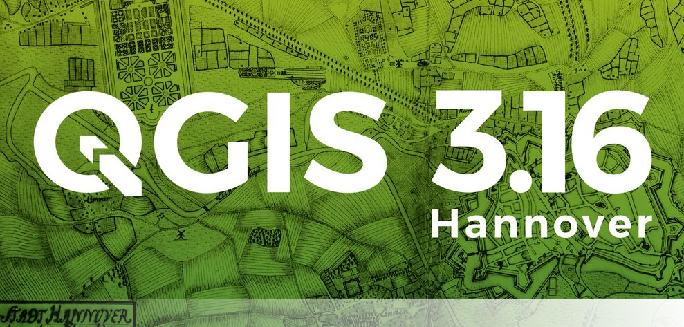</a> | main_angle, to_decimal, overlay_*
[QGIS 3.14 Pi](novita_314.md)  |19/06/2020 | <a href="https://www.qgis.org/it/site/forusers/visualchangelog314/index.html" target="_blank">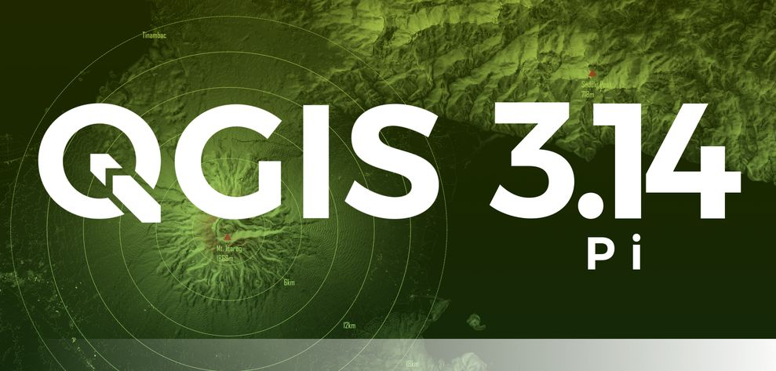</a> |ascii, is_multipart, min_z, maax_z, min_m, max_m, close_line, make_date, make_time, make_datetime, make_interval
[QGIS 3.12 București](novita_312.md)  |21/02/2020 | <a href="https://www.qgis.org/it/site/forusers/visualchangelog312/index.html" target="_blank">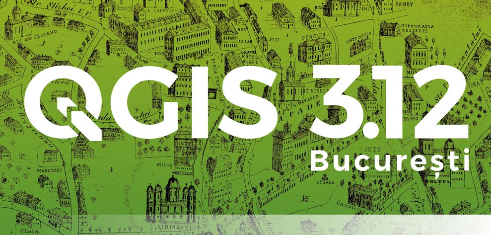</a> |ascii, is_multipart, min_z, maax_z, min_m, max_m, close_line, make_date, make_time, make_datetime, make_interval
[QGIS 3.10 A Coruña](novita_310.md)  |25/10/2019 | <a href="https://www.qgis.org/it/site/forusers/visualchangelog310/index.html" target="_blank">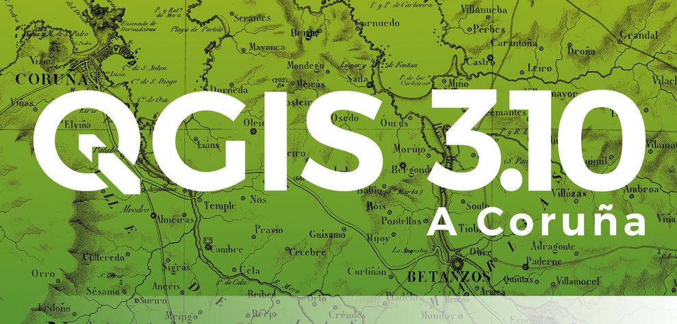</a> | attributes, to_date, to_datetime, to_time, collect_geometries, make_line
[QGIS 3.8 Zanzibar](novita_38.md)  |21/06/2019 | <a href="https://www.qgis.org/it/site/forusers/visualchangelog38/index.html" target="_blank">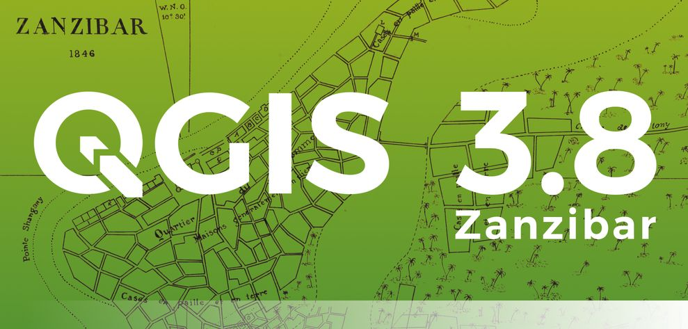</a> | concatenate_unique, array_all, ecc...
[QGIS 3.6 Noosa](novita_36.md)  |22/02/2019 | <a href="https://www.qgis.org/it/site/forusers/visualchangelog36/index.html" target="_blank">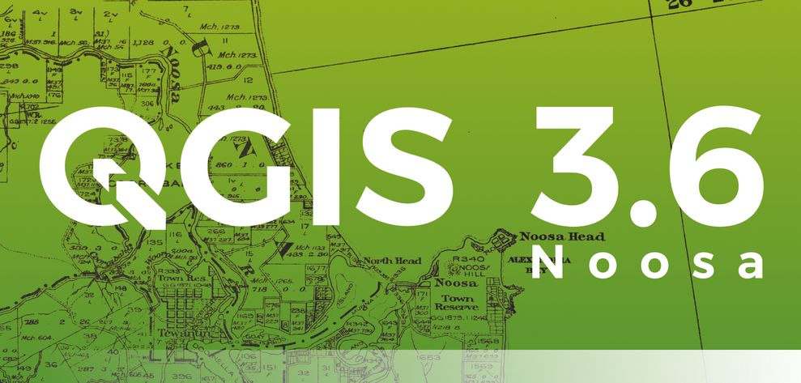</a> | force_rhr, make_rectangle_3points, make_square, decode_uri, nullif, try, from_jsom, to_json, sqlite_fecth_and_increment ecc...
[QGIS 3.4 Madeira](novita_34.md)  |26/10/2018 |  |  raster_value(), line_substring, array_foreach, generate_series, array_filter, to_dm, to_dms, hstore_to_map, json_to_map, map_to_hstore, map_to_json, ecc...
[QGIS 3.2 Bonn](novita_32.md)  |22/06/2018 | <a href="https://www.qgis.org/it/site/forusers/visualchangelog32/index.html" target="_blank">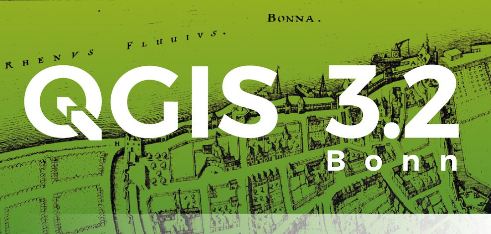</a> | nuove variabili, ecc...
[QGIS 3.0 Girona](novita_30.md)  |23/02/2018 | <a href="https://www.qgis.org/it/site/forusers/visualchangelog30/index.html" target="_blank">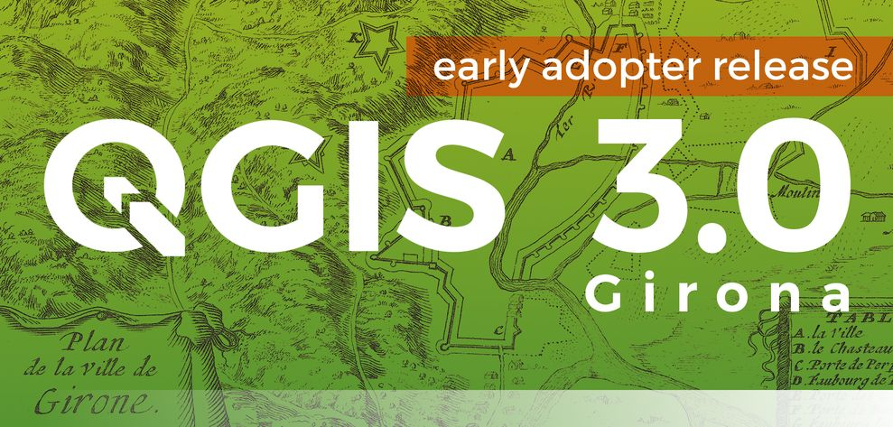</a> | vedi changelog

---

## Grafico

[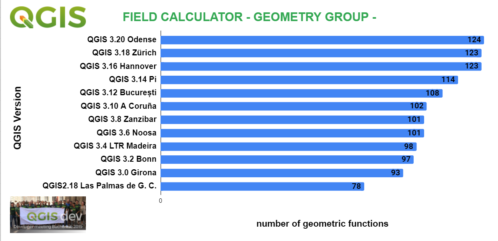](../img/grafico_espressioni1.png)