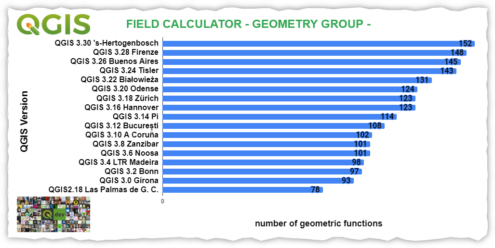

# Novità

!!! Abstract
    **In questa sezione verranno documentate le principali novità implementate nel _calcolatore di campi_ e _tabella degli attributi_, come per esempio nuove funzioni o nuove funzionalità legate alle tabelle.**

---

## Release

Release        | Data | changelog | nuove funzioni | numero
---------------|------|-----------|----------------|-------------
[QGIS 3.42 Prizren](novita_342.md)  |21/02/2025 |  | 
[QGIS 3.40 Prizren](novita_340.md)  |25/10/2024 |  | 
[QGIS 3.38 Prizren](novita_338.md)  |21/06/2024 |  | 
[QGIS 3.36 Prizren](novita_336.md)  |23/02/2024 |  | 
[QGIS 3.34 Prizren](novita_334.md)  |27/10/2023 |  |[bearing](../gr_funzioni/geometria/geometria_unico.md#bearing), [layer_crs_ellipsoid](../gr_funzioni/variabili/variabili_unico.md#variabili) | +2
[QGIS 3.32 Lima](novita_332.md)  |23/06/2023 |  |[ltrim](../gr_funzioni/stringhe_di_testo/stringhe_di_testo_unico.md#ltrim), [rtrim](../gr_funzioni/stringhe_di_testo/stringhe_di_testo_unico.md#rtrim) | +2
[QGIS 3.30 's-Hertogenbosch](novita_330.md)  |03/03/2023 |  |[load_layer](../gr_funzioni/layer_mappa/layer_mappa_unico.md#load_layer), [is_feature_valid()](../gr_funzioni/record_e_attributi/record_e_attributi_unico.md#is_feature_valid), [is_attribute_valid()](../gr_funzioni/record_e_attributi/record_e_attributi_unico.md#is_attribute_valid), [x_at](../gr_funzioni/geometria/geometria_unico.md#x_at), [y_at](../gr_funzioni/geometria/geometria_unico.md#x_at), [z_at](../gr_funzioni/geometria/geometria_unico.md#X_at), [m_at](../gr_funzioni/geometria/geometria_unico.md#M_at) | +4
[QGIS 3.28 Firenze](novita_328.md)  |21/10/2022 |  | [make_valid](../gr_funzioni/geometria/geometria_unico.md#make_valid), [geometries_to_array](../gr_funzioni/array/array_unico.md#geometries_to_array), [concave_hull](../gr_funzioni/geometria/geometria_unico.md#concave_hull), [shared_paths](../gr_funzioni/geometria/geometria_unico.md#shared_paths), [@feature](../gr_funzioni/record_e_attributi/record_e_attributi_unico.md#currentfeature), [@id](../gr_funzioni/record_e_attributi/record_e_attributi_unico.md#$id) e [@geometry](../gr_funzioni/geometria/geometria_unico.md#geometry)| +7
[QGIS 3.26 Buones Aires](novita_326.md)  |18/06/2022 |  | [BETWEEN](../gr_funzioni/operatori/operatori_unico.md#between),  [NOT BETWEEN](../gr_funzioni/operatori/operatori_unico.md#notbetween)| +2
[QGIS 3.24 Tisler](novita_324.md)  |18/02/2022 |  | [scale](../gr_funzioni/geometria/geometria_unico.md#scale), [triangular_wave](../gr_funzioni/geometria/geometria_unico.md#triangular_wave), [square_wave](../gr_funzioni/geometria/geometria_unico.md#square_wave), [wave](../gr_funzioni/geometria/geometria_unico.md#wave), [triangular_wave_randomized](../gr_funzioni/geometria/geometria_unico.md#triangular_wave_randomized), [square_wave_randomized](../gr_funzioni/geometria/geometria_unico.md#square_wave_randomized), [wave_randomized](../gr_funzioni/geometria/geometria_unico.md#wave_randomized), overlay_nearest+, [apply_dash_pattern](../gr_funzioni/geometria/geometria_unico.md#apply_dash_pattern), [force_polygon_cw](../gr_funzioni/geometria/geometria_unico.md#force_polygon_cw), [force_polygon_ccw](../gr_funzioni/geometria/geometria_unico.md#force_polygon_ccw), [densify_by_count](../gr_funzioni/geometria/geometria_unico.md#densify_by_count), [densify_by_distance](../gr_funzioni/geometria/geometria_unico.md#densify_by_distance), [roundness](../gr_funzioni/geometria/geometria_unico.md#roundness), overlay_intersects+, geometry_n+, [geometry_type](../gr_funzioni/geometria/geometria_unico.md#geometry_type), get_feature+, [represent_attributes](../gr_funzioni/record_e_attributi/record_e_attributi_unico.md#represent_attributes), [map_prefix_keys](../gr_funzioni/maps/maps_unico.md#map_prefix_keys), [url_encode](../gr_funzioni/maps/maps_unico.md#url_encode), [rotate](../gr_funzioni/geometria/geometria_unico.md#rotate) | +17
[QGIS 3.22 Białowieża](novita_322.md)  |22/10/2021 |  | exif, exif_geotag, sinuosity, $z, affine_transform, straight_distance_2d, vertex_as_point, vertex_z | +8
[QGIS 3.20 Odense](novita_320.md)  |21/06/2021 |  | length3D, array_count, array_priorize, array_replace, mime_type | +5
[QGIS 3.18 Zürich](novita_318.md)  |22/02/2021 |  | UUID, array_get, array_min, arra_max, array_majority, array_sum, array_mean, array_median, map_credits, @layer_crs | +10
[QGIS 3.16 Hannover](novita_316.md)  |23/10/2020 |  | main_angle, to_decimal, overlay_* | +10
[QGIS 3.14 Pi](novita_314.md)  |19/06/2020 |  |ascii, is_multipart, min_z, max_z, min_m, max_m, close_line, make_date, make_time, make_datetime, make_interval | +11
[QGIS 3.12 București](novita_312.md)  |21/02/2020 |  | rand, randf, is_valid, is_empty, is_empty_or_null, rotate, datetime_from_epoch, format_date, hash, md5, sha256, geom_to_wkb, geom_from_wkb | +13
[QGIS 3.10 A Coruña](novita_310.md)  |25/10/2019 |  | attributes, to_date, to_datetime, to_time, collect_geometries, make_line | +6
[QGIS 3.8 Zanzibar](novita_38.md)  |21/06/2019 |  | concatenate_unique, array_all, ecc...
[QGIS 3.6 Noosa](novita_36.md)  |22/02/2019 |  | force_rhr, make_rectangle_3points, make_square, decode_uri, nullif, try, from_jsom, to_json, sqlite_fecth_and_increment ecc...
[QGIS 3.4 Madeira](novita_34.md)  |26/10/2018 |  |  raster_value(), line_substring, array_foreach, generate_series, array_filter, to_dm, to_dms, hstore_to_map, json_to_map, map_to_hstore, map_to_json, ecc...
[QGIS 3.2 Bonn](novita_32.md)  |22/06/2018 |  | nuove variabili, ecc...
[QGIS 3.0 Girona](novita_30.md)  |23/02/2018 |  | vedi changelog

---

## Grafico

