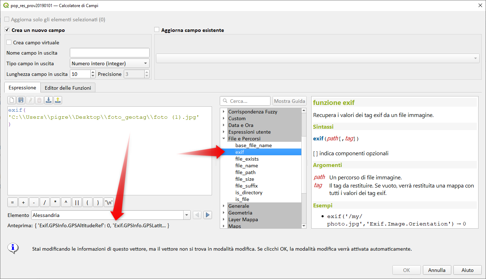
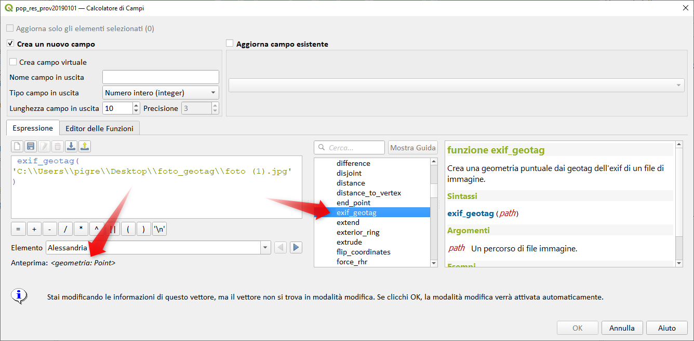
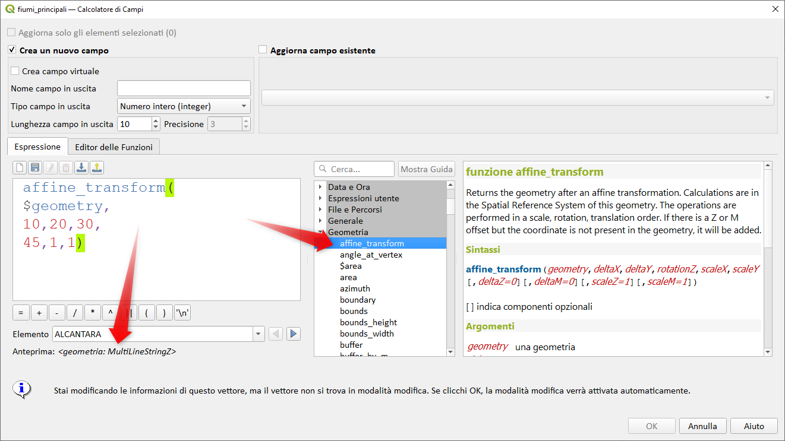

# Novità rilevanti introdotte nella 3.22 Białowieża


<https://www.qgis.org/it/site/forusers/visualchangelog322/index.html>


## Espressioni

- `exif() and exif_geotag()` : https://github.com/qgis/QGIS/pull/44081



sotto elenco completo dei tag disponibili:

```
Exif.GPSInfo.GPSAltitude
Exif.GPSInfo.GPSAltitudeRef
Exif.GPSInfo.GPSDateStamp
Exif.GPSInfo.GPSLatitude
Exif.GPSInfo.GPSLatitudeRef
Exif.GPSInfo.GPSLongitude
Exif.GPSInfo.GPSLongitudeRef
Exif.GPSInfo.GPSProcessingMethod
Exif.GPSInfo.GPSTimeStamp
Exif.GPSInfo.GPSVersionID
Exif.Image.0xea1c
Exif.Image.Artist
Exif.Image.DateTime
Exif.Image.ExifTag
Exif.Image.GPSTag
Exif.Image.ImageLength
Exif.Image.ImageWidth
Exif.Image.Make
Exif.Image.Model
Exif.Image.ResolutionUnit
Exif.Image.Software
Exif.Image.XPKeywords
Exif.Image.XResolution
Exif.Image.YCbCrPositioning
Exif.Image.YResolution
Exif.Iop.InteroperabilityVersion
Exif.Iop.RelatedImageLength
Exif.Iop.RelatedImageWidth
Exif.Photo.0xea1c
Exif.Photo.ColorSpace
Exif.Photo.ComponentsConfiguration
Exif.Photo.Contrast
Exif.Photo.DateTimeDigitized
Exif.Photo.DateTimeOriginal
Exif.Photo.DigitalZoomRatio
Exif.Photo.ExifVersion
Exif.Photo.ExposureBiasValue
Exif.Photo.ExposureMode
Exif.Photo.ExposureProgram
Exif.Photo.ExposureTime
Exif.Photo.FNumber
Exif.Photo.Flash
Exif.Photo.FlashpixVersion
Exif.Photo.FocalLength
Exif.Photo.GainControl
Exif.Photo.ISOSpeedRatings
Exif.Photo.ImageUniqueID
Exif.Photo.InteroperabilityTag
Exif.Photo.LightSource
Exif.Photo.MaxApertureValue
Exif.Photo.MeteringMode
Exif.Photo.PixelXDimension
Exif.Photo.PixelYDimension
Exif.Photo.Saturation
Exif.Photo.SceneCaptureType
Exif.Photo.Sharpness
Exif.Photo.UserComment
Exif.Photo.WhiteBalance
Exif.Thumbnail.Compression
Exif.Thumbnail.JPEGInterchangeFormat
Exif.Thumbnail.JPEGInterchangeFormatLength
Exif.Thumbnail.ResolutionUnit
Exif.Thumbnail.XResolution
Exif.Thumbnail.YResolution
```



- `sinuosity` : https://github.com/qgis/QGIS/pull/44401


- `straight_distance_2d` : https://github.com/qgis/QGIS/pull/44767


- `$z` : https://github.com/qgis/QGIS/pull/44776


- `affine_transform` : https://github.com/qgis/QGIS/pull/44771



## Tabella attributi

- tabella attributi : https://github.com/qgis/QGIS/pull/44471


## Widget

- widget : https://github.com/qgis/QGIS/pull/44710


## Mesh

saranno aggiunte in futuro maggiori info

- `selezione tramite espressione` : https://github.com/qgis/QGIS/pull/44835


- `$vertex_as_point and $vertex_z functions` : https://github.com/qgis/QGIS/pull/44786
