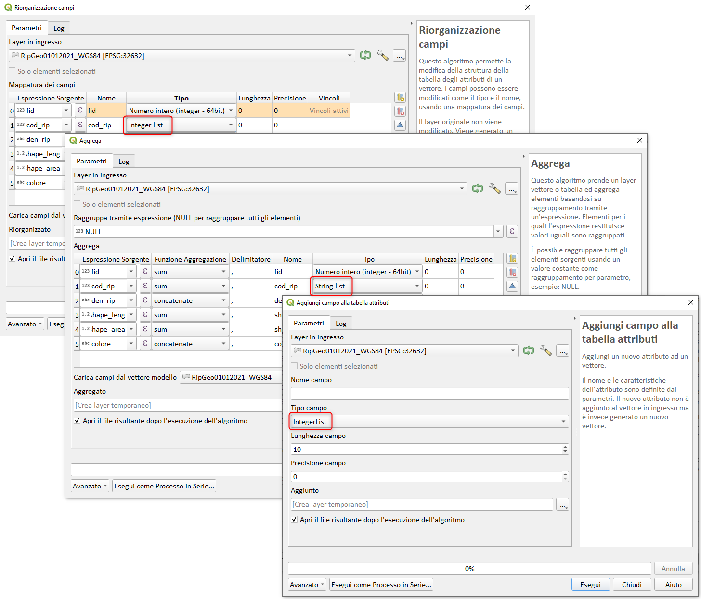

# Novità rilevanti introdotte in QGIS 3.24 Tisler IN LAVORAZIONE!!!

<https://changelog.qgis.org/en/qgis/version/3.24/>

## Espressioni

### Gruppo Geometria
funzione                                                                                  | link PR                                   | descrizione
------------------------------------------------------------------------------------------|-------------------------------------------|---------------------
[scale](../gr_funzioni/geometria/geometria_unico.md#scale)                                | <https://github.com/qgis/QGIS/pull/45505> | nuova funzione
[triangular/square/curved](../gr_funzioni/geometria/geometria_unico.md#triangular_wave)   | <https://github.com/qgis/QGIS/pull/45583> | nuove funzione (6)
[overlay_nearest](../gr_funzioni/geometria/geometria_unico.md#overlay_nearest)            | <https://github.com/qgis/QGIS/pull/45744> | miglioramenti
[apply_dash_pattern](../gr_funzioni/geometria/geometria_unico.md#apply_dash_pattern)      | <https://github.com/qgis/QGIS/pull/45734> | nuova funzione
[force_polygon_cw/ccw](../gr_funzioni/geometria/geometria_unico.md#force_polygon_ccw)     | <https://github.com/qgis/QGIS/pull/45718> | nuove funzione (2)
[densify_by_count/distance](../gr_funzioni/geometria/geometria_unico.md#densify_by_count) | <https://github.com/qgis/QGIS/pull/45894> | nuove funzione (2)
[roundness](../gr_funzioni/geometria/geometria_unico.md#roundness)                        | <https://github.com/qgis/QGIS/pull/45154> | nuova funzione
[overlay_intersects](../gr_funzioni/geometria/geometria_unico.md#overlay_intersects)      | <https://github.com/qgis/QGIS/pull/46185> | miglioramenti
[overlay_intersects](../gr_funzioni/geometria/geometria_unico.md#overlay_intersects)      | <https://github.com/qgis/QGIS/pull/46683> | miglioramenti
[geometry_n](../gr_funzioni/geometria/geometria_unico.md#geometry_n)                      | <https://github.com/qgis/QGIS/pull/46684> | modifica definizione
[geometry_type](../gr_funzioni/geometria/geometria_unico.md#geometry_n)                   | <https://github.com/qgis/QGIS/pull/46716> | nuova funzione
[rotate](../gr_funzioni/geometria/geometria_unico.md#rotate)                              | <https://github.com/qgis/QGIS/pull/45748> | miglioramento

### Gruppo Record e Attributi
funzione                                                                                                   | link PR                                   | descrizione
-----------------------------------------------------------------------------------------------------------|-------------------------------------------|---------------
[get_feature](../gr_funzioni/record_e_attributi/record_e_attributi_unico.md#get_feature)                   | <https://github.com/qgis/QGIS/pull/43352> | miglioramenti
[represent_attributes](../gr_funzioni/record_e_attributi/record_e_attributi_unico.md#represent_attributes) | <https://github.com/qgis/QGIS/pull/46502> | nuova funzione

### Gruppo Array
funzione                                                               | link PR                                   | descrizione
-----------------------------------------------------------------------|-------------------------------------------|--------------
[array_remove_at](../gr_funzioni/array/array_unico.md#array_remove_at) | <https://github.com/qgis/QGIS/pull/46942> | miglioramento

### Gruppo Maps
funzione                                                             | link PR                                   | descrizione
---------------------------------------------------------------------|-------------------------------------------|---------------
[map_prefix_keys](../gr_funzioni/maps/maps_unico.md#map_prefix_keys) | <https://github.com/qgis/QGIS/pull/46087> | nuova funzione
[url_encode](../gr_funzioni/maps/maps_unico.md#url_encode)           | <https://github.com/qgis/QGIS/pull/46384> | nuova funzione

### PR chiusa
`annotazioni`: ~~<https://github.com/qgis/QGIS/pull/45114>~~ chiusa!!!

## GUI Field Calc
`esponi i nomi dei campi da layer richiamati`: <https://github.com/qgis/QGIS/pull/46505>

`ricerca migliorata`: <https://github.com/qgis/QGIS/pull/46672>

## GUI/UX
`apri tabella attributi`: <https://github.com/qgis/QGIS/pull/46328>| Nuovo bottone!

## CORE

Gli utenti possono utilizzare espressioni come `array(1,2,3)` o `map('key1','value','key2','value')` espressioni nel calcolatore di campo e nella barra dei campi della tabella degli attributi per aggiornare i valori. <https://github.com/qgis/QGIS/pull/47046>

## Gli Array diventano un formato di campo

<https://github.com/qgis/QGIS/pull/47049>

