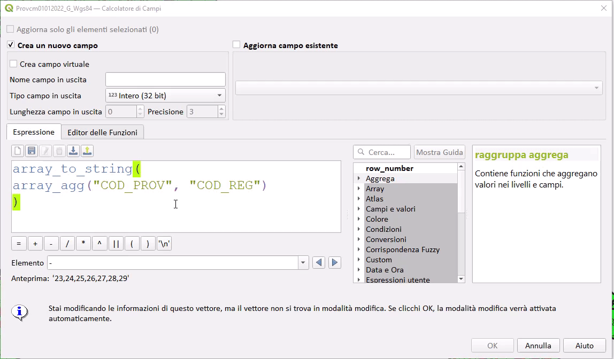

# Novità rilevanti introdotte in QGIS 3.26 IN LAVORAZIONE!!!

xxxxxxxx

<https://changelog.qgis.org/en/qgis/version/3.26/>

## Espressioni

### Gruppi
funzione              | link PR                                   | descrizione
----------------------|-------------------------------------------|------------
BETWEEN e NOT BETWEEN | <https://github.com/qgis/QGIS/pull/47771> | Nuovo Operatore

## GUI Field Calc
- `copia valore espressione anteprima fielc calc`: <https://github.com/qgis/QGIS/pull/47680>

- `scorrimento tabella attributi in orizzontale` : <https://github.com/qgis/QGIS/pull/47764>

## Tabella attributi

Nomi dei campi definiti dall'utente nell'esportazione: <https://github.com/qgis/QGIS/pull/47630>

