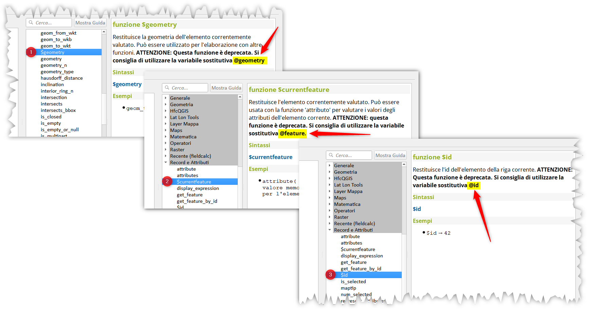
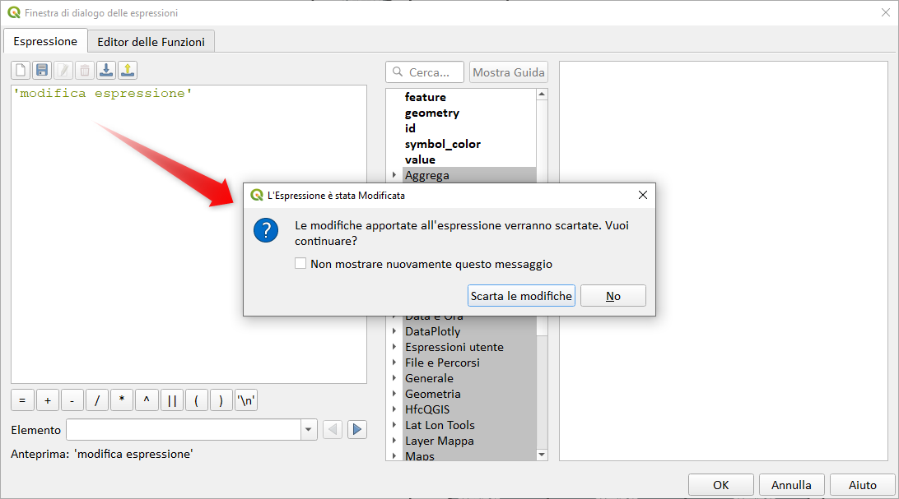

# Novità rilevanti introdotte in QGIS 3.28 IN LAVORAZIONE!!!

xxxx

<https://changelog.qgis.org/en/qgis/version/3.28/>

## Espressioni

nuove espressioni:

funzione              | link PR                                   | descrizione
----------------------|-------------------------------------------|------------
Adds the $m, $z_at and $m_at expressions | <https://github.com/qgis/QGIS/pull/49765> | CHIUSA!!!
Make_valid e geometries_to_array | <https://github.com/qgis/QGIS/pull/49993> | nuove funzioni
Concave_hull | <https://github.com/qgis/QGIS/pull/48865> | nuova funzione
to_int | <https://github.com/qgis/QGIS/pull/49990> | miglioramento
help geometrices_to_array | <https://github.com/qgis/QGIS/pull/50077> | miglioramento
shared_paths | <https://github.com/qgis/QGIS/pull/50080> | nuova funzione
@feature, @id e @geometry | <https://github.com/qgis/QGIS/pull/50134> | nuove variabili

## GUI Field Calc

Per evitare di perdere le modifiche alle espressioni nel Field Calc

- <https://github.com/qgis/QGIS/pull/49883>

## HELP IN LINEA

- <https://github.com/qgis/QGIS/commit/264221442c7f0bdf39f8409690a777bc90b26b35>
- <https://github.com/qgis/QGIS/pull/50404>
