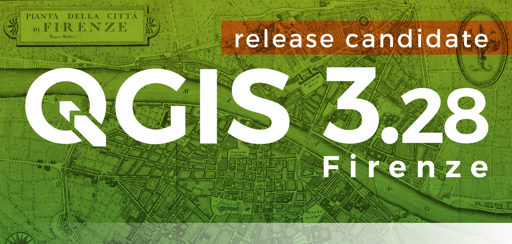

# Novità rilevanti introdotte in QGIS 3.28 IN LAVORAZIONE!!!

xxxx

<https://changelog.qgis.org/en/qgis/version/3.28/>

## Espressioni

nuove espressioni : <https://github.com/qgis/QGIS/pull/49765>
**Make_valid** e **geometries_to_array**: <https://github.com/qgis/QGIS/pull/49993>
migliora **to_int** : <https://github.com/qgis/QGIS/pull/49990>
help: <https://github.com/qgis/QGIS/pull/50077>
**shared_paths** : <https://github.com/qgis/QGIS/pull/50080>
NB: <https://github.com/qgis/QGIS/pull/50134>

### Gruppi

## GUI Field Calc

-<https://github.com/qgis/QGIS/pull/49883>

## Tabella attributi

## hELP IN LINEA

<https://github.com/qgis/QGIS/commit/264221442c7f0bdf39f8409690a777bc90b26b35>
<https://github.com/qgis/QGIS/pull/50404>
