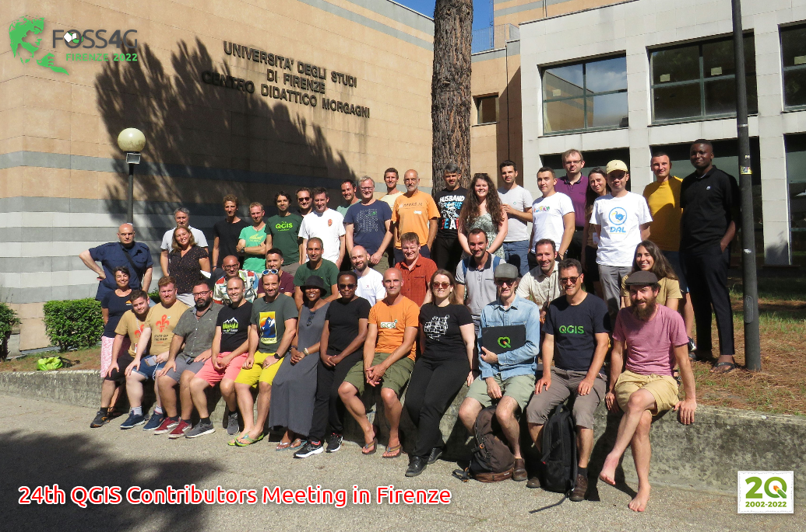

# Novità rilevanti introdotte in QGIS 3.28 Firenze

QGIS 3.28 Firenze introduces various feature updates, UX modifications, usability enhancements, and improved integration with various proprietary services and data backends. It is also set to introduce the long-awaited features provided by previous releases into the long-term support release, as outlined in the QGIS Roadmap.

The splash screen features a rare and extraordinary 1847 map of Firenze, or Florence, Italy by Giuseppe Molini. This magnificently engraved map was originally drawn in 1731 by the Florentine architect Ferdinando Ruggieri. Oriented to the south, the map covers the old walled center of Florence as it extends on both sides of the Arno River. The upper right quadrant features the lily symbol of Florence. Though printed in 1847, this map has been prepared in the 17th-century style by copperplate engraving on thick-laid paper. Firenze in 1847 was on the cusp of political transformation. One year following the production of this rare map the Grand Duke of Tuscany, responding to political demonstrations throughout Florence, granted Tuscany its first constitution.

<https://changelog.qgis.org/en/qgis/version/3.28/>

genesi dello splashscreen:

<https://github.com/pigreco/splashscreen_QGIS328_Firenze>

## Espressioni

nuove espressioni:

funzione              | link PR                                   | descrizione
----------------------|-------------------------------------------|------------
~~Adds the $m, $z_at and $m_at expressions~~ | <https://github.com/qgis/QGIS/pull/49765> | CHIUSA!!!
[make_valid](../gr_funzioni/geometria/geometria_unico.md#make_valid) e [geometries_to_array](../gr_funzioni/array/array_unico.md#geometries_to_array) | <https://github.com/qgis/QGIS/pull/49993> | nuove funzioni
[concave_hull](../gr_funzioni/geometria/geometria_unico.md#concave_hull) | <https://github.com/qgis/QGIS/pull/48865> | nuova funzione
~~to_int~~ | <https://github.com/qgis/QGIS/pull/49990> | PR ancora aperta
[shared_paths](../gr_funzioni/geometria/geometria_unico.md#shared_paths) | <https://github.com/qgis/QGIS/pull/50080> | nuova funzione
[@feature](../gr_funzioni/record_e_attributi/record_e_attributi_unico.md#currentfeature), [@id](../gr_funzioni/record_e_attributi/record_e_attributi_unico.md#$id) e [@geometry](../gr_funzioni/geometria/geometria_unico.md#geometry) | <https://github.com/qgis/QGIS/pull/50134> | nuove variabili

Anche nel gruppo Campi e Valore:

## GUI Field Calc

Per evitare di perdere le modifiche alle espressioni nel Field Calc

- <https://github.com/qgis/QGIS/pull/49883>

## HELP IN LINEA

- <https://github.com/qgis/QGIS/commit/264221442c7f0bdf39f8409690a777bc90b26b35>
- <https://github.com/qgis/QGIS/pull/50404>
