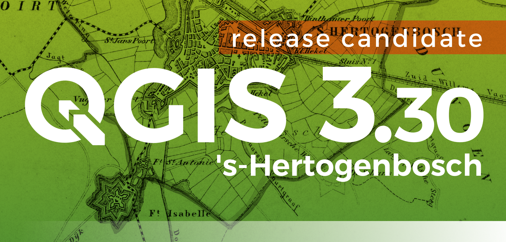

# Novità rilevanti introdotte in QGIS 3.30 s-Hertogenbosch

The 3.30 's-Hertogenbosch release of the groundbreaking QGIS project introduces a wide range of changes and optimizations from the QGIS developer community.

The splash screen features a fragment of the “Gemeentekaart”, or Municipality map, of 's-Hertogenbosch from 1867. It is part of a series of 1200 maps of all the communities in The Netherlands from that time, which were published in an atlas for each of the 11 regions. All maps were drawn in the same size, although for large municipalities a double format was used and scaled to match the page. The series was internationally rewarded because of its accuracy and completeness. The map was drawn by Jacob Kuyper (1821-1908), the most famous geographer and cartographer of his time in The Netherlands. Text and splash map image provided by atlasandmap.com

Importantly, support for backward compatibility of Symbol Styling has been removed for QGIS 3.16, providing significant optimizations to the project file structure, but limiting the capability of older releases of QGIS for rendering symbologies developed with later releases.

The native GeoNode integration has also been migrated to an external plugin, leveraging the powerful extensions to the QGIS API for plugins implemented in recent releases.

Users can also look forward to new functionality and UX enhancements, including support for raster attribute tables, intelligent and configurable sorting for layer loading, improvements to GPS utilities, more dynamic form widgets, native rich media previews for attachments, better integration with cloud services, extensions to the QGIS metadata standards, and a host of other noteworthy additions.

<https://changelog.qgis.org/en/qgis/version/3.30/>

## Espressioni

nuove espressioni:

funzione              | link PR                                   | descrizione
----------------------|-------------------------------------------|------------
[load_layer](../gr_funzioni/layer_mappa/layer_mappa_unico.md#load_layer) (solo in Processing)| <https://github.com/qgis/QGIS/pull/51293> | nuova funzione
[is_feature_valid()](../gr_funzioni/record_e_attributi/record_e_attributi_unico.md#is_feature_valid) e [is_attribute_valid()](../gr_funzioni/record_e_attributi/record_e_attributi_unico.md#is_attribute_valid) | <https://github.com/qgis/QGIS/pull/51303> | nuove funzioni
[feature_id](../gr_funzioni/record_e_attributi/record_e_attributi_unico.md#feature_id) | <https://github.com/qgis/QGIS/pull/51441> | nuova funzione
~~[ltrim], [rtrim]~~ | ~~<https://github.com/qgis/QGIS/pull/51786>~~ | nuove funzioni - ancora congelate!!!
[x_at](../gr_funzioni/geometria/geometria_unico.md#x_at), [y_at](../gr_funzioni/geometria/geometria_unico.md#y_at), [z_at](../gr_funzioni/geometria/geometria_unico.md#z_at) e [m_at](../gr_funzioni/geometria/geometria_unico.md#m_at) | <https://github.com/qgis/QGIS/pull/50853> | nuove funzioni ($x_at() e $y_at() sono state deprecate)

## Tabella degli attributi

- [Aggiungi uno stile condizionale basato su vincoli e un filtro delle funzionalità dei vincoli in errore](https://github.com/qgis/QGIS/pull/51309)

## Widget

- [Supporta current_value nel widget HTML](https://github.com/qgis/QGIS/pull/51316)

- [Widget di testo](https://github.com/qgis/QGIS/pull/51323)

- [Stato modificabile del widget del modulo definito dai dati](https://github.com/qgis/QGIS/pull/51525)

