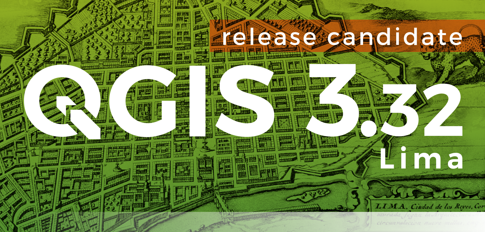
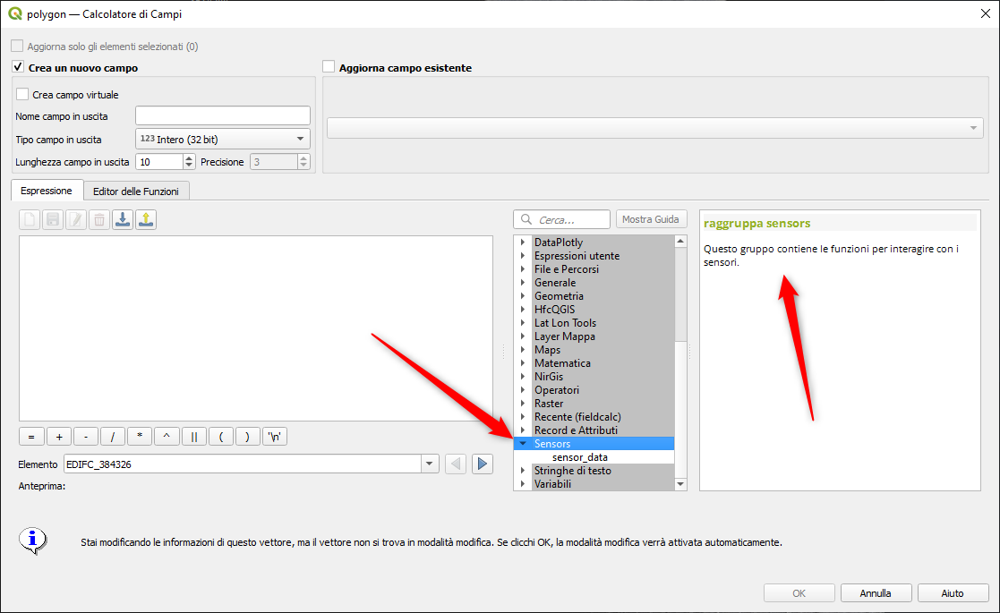
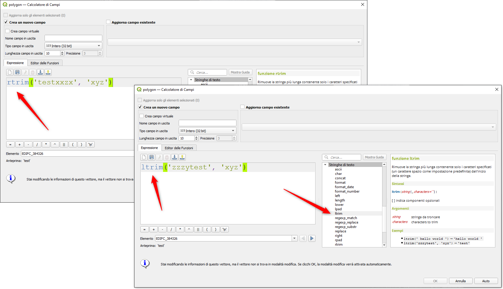

# Novità rilevanti introdotte in QGIS 3.32 Lima

QGIS 3.32 is a major release of the QGIS Project that brings a significant advancement in geospatial technology to the Open Source World. The developer community has introduced several new features and improvements to leverage the potential of geospatial data.

Amongst numerous quality of life improvements across a broad spectrum of existing features, the 3.32 release features the long awaited functionality for Native Point Cloud Processing in QGIS, allowing QGIS Desktop to become a powerful processing utility for LiDAR data.

This milestone achievement is thanks in large part to the contributions of the community to the effective crowd funding campaign which funded this development, the QGIS community and Enhancement Proposals used for the effective governance of these contributions, the collaborative efforts of the development agencies involved, and of course the extraordinary contributions of individual developers who build these tools for the benefit of all.

This release also includes a wide variety of developer experience enhancements, extensions to new functionalities like the profile plots and processing frameworks, and a new framework for sensor data to tightly integrate QGIS with data collection apparatus and facilitate the creation of next-generation intelligent solutions.

QGIS is a community effort, and we would like to extend a big thank you to the developers, documenters, testers, and the many folks out there who volunteer their time and effort (or fund people to do so) to make these releases possible. From the QGIS community, we hope you enjoy this release! If you wish to donate time, money, or otherwise contribute towards making QGIS more awesome, please wander along to QGIS.ORG and lend a hand!

QGIS is supported by donors and sustaining members. A current list of donors who have made financial contributions large or small to the project can be seen on our list of donors. If you would like to become an official project sustaining member, please visit our sustaining member page for more details. Sponsoring QGIS helps us to fund our regular developer meetings, maintain project infrastructure, and fund bug-fixing efforts. A complete list of current sponsors is provided below - our very great thank you to all of our sponsors!

QGIS is free software and you are under no obligation to pay anything to use it - in fact, we want to encourage people far and wide to use it regardless of their financial or social status - we believe that empowering people with spatial decision-making tools will result in a better society for all of humanity.

<https://changelog.qgis.org/en/qgis/version/3.32/>

## Novità versione

- nuovo gruppo funzione Sensors: <https://github.com/qgis/QGIS/pull/52527>

- funzioni ltrim/rtrim: <https://github.com/qgis/QGIS/pull/51786>

