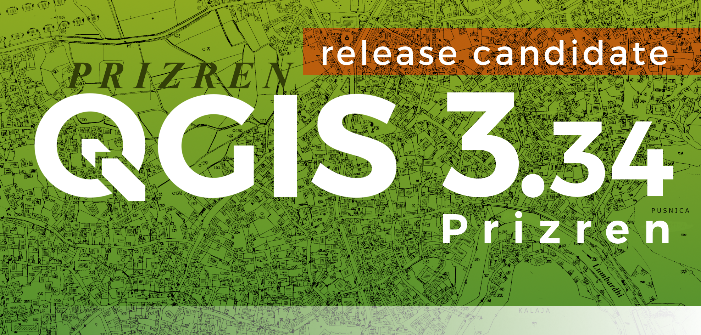
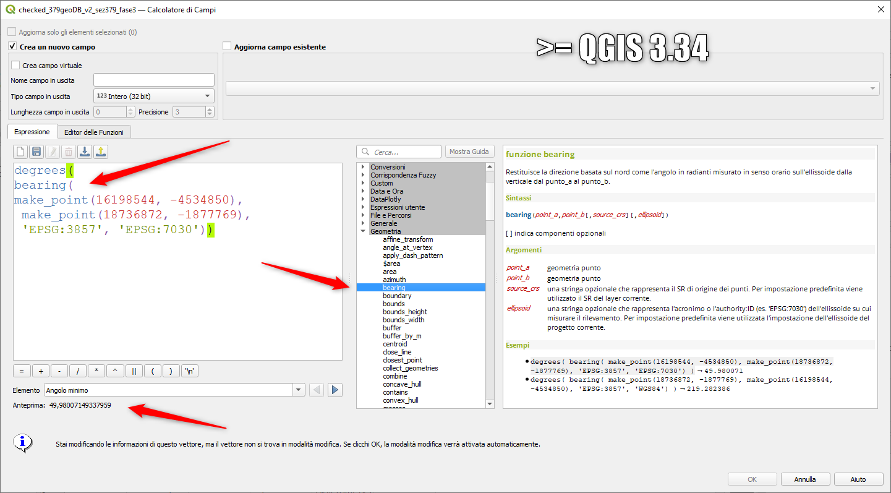
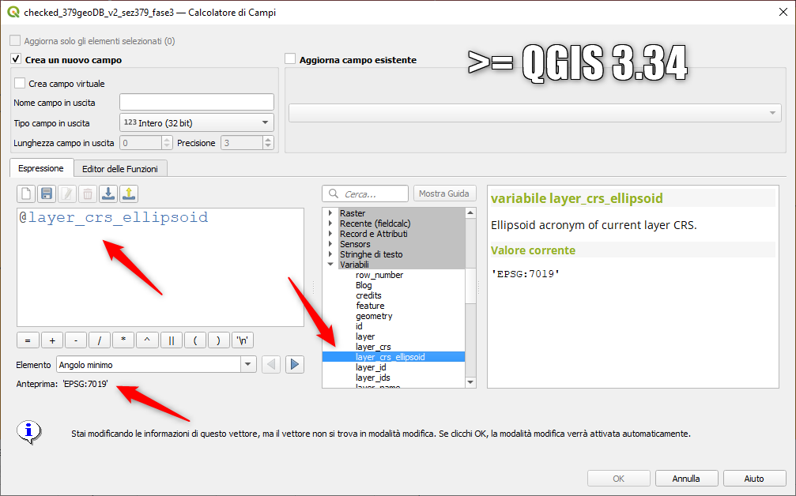

# Novità rilevanti introdotte in QGIS 3.34

<https://changelog.qgis.org/en/qgis/version/3.34/>

## espressioni

- gruppo geometria - funzione bearing: <https://github.com/qgis/QGIS/pull/54297>

- gruppo variabili - layer_crs_ellipsoid: <https://github.com/qgis/QGIS/pull/54555>

- aggiornata l'espressione `array_foreach` con l'aggiunta della variabile `@counter`
<https://github.com/qgis/QGIS/pull/54962>

- Migliorato l'inserimente delle espressioni
<https://github.com/qgis/QGIS/pull/54764>

