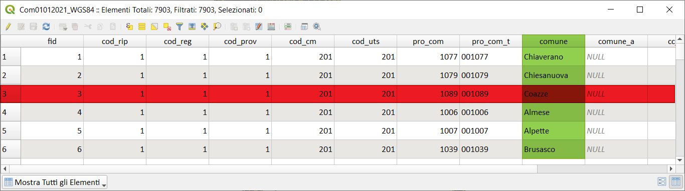
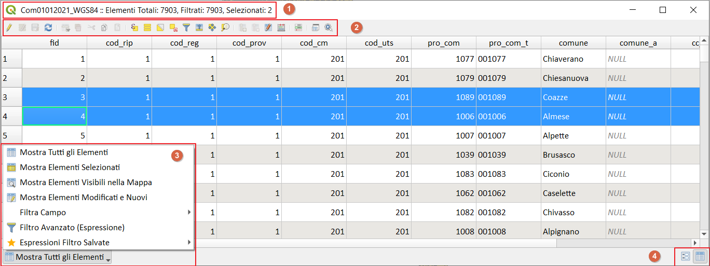
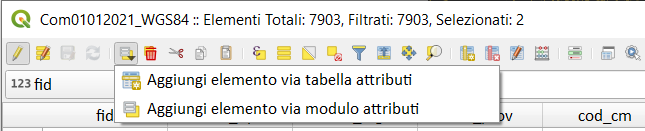
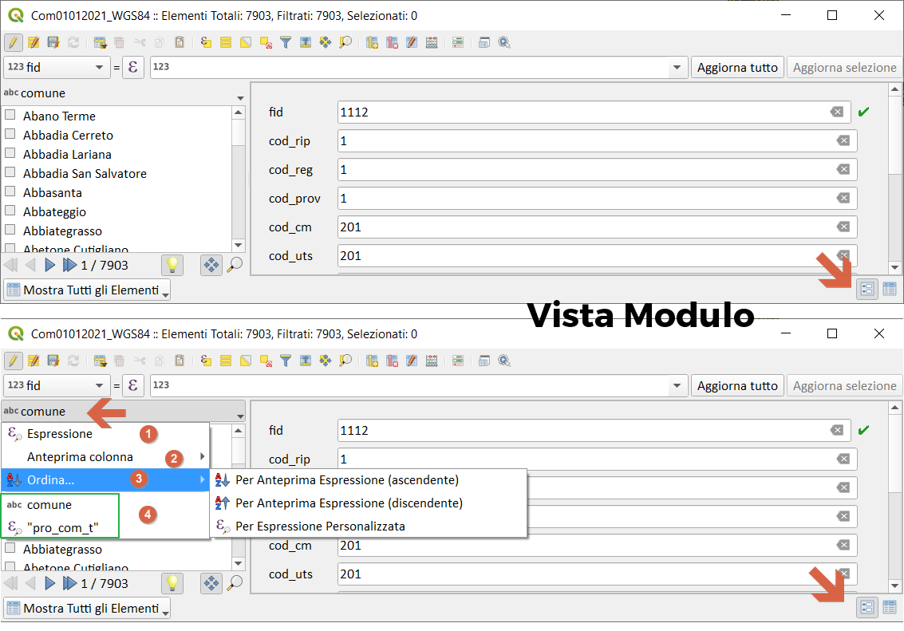
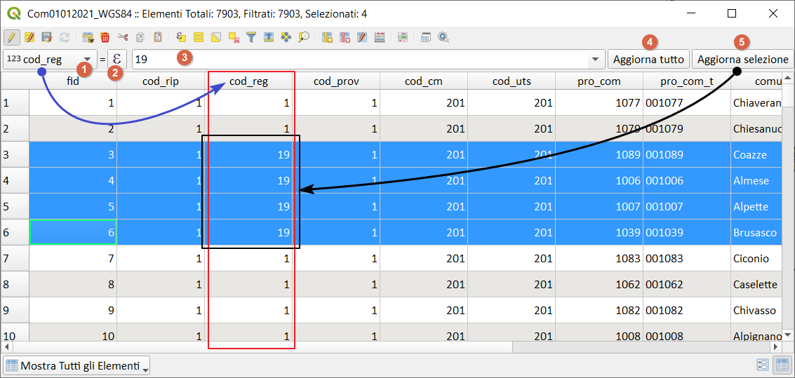
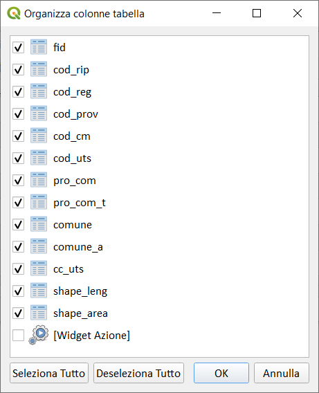
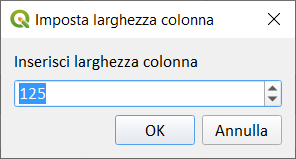

# Concetti fondamentali sulla tabella degli attributi di QGIS

!!! Abstract "Intro"
    **In questa sezioni sono raccolti i concetti fondamentali sulla tabella degli attributi. La conoscenza di questi concetti permette di velocizzare il lavoro e capire il comportamento della tabella.**

[QGIS-DOC](https://docs.qgis.org/3.16/it/docs/user_manual/working_with_vector/attribute_table.html)

La tabella degli attributi  (**F6**) è una tabella che contiene i dati alfanumerici (attributi) dello strato vettoriale e rappresenta una delle differenze fondamentali tra un vettore CAD e uno GIS.

Negli shapefile la tabella degli attributi rappresenta il file `.dbf` che è uno dei tre file fondamentali che caratterizzano lo shapefile (.shp, .shx, .dbf) la mancanza di uno di questi rende inutilizzabile lo strato.

Una tabella è caratterizzata da righe (rosso) e colonne (verde), le righe rappresentano i record (nello specifico una feature), le colonne (o campi) rappresentano gli attributi:

**Osservazione**: la geometria è anch'essa un attributo (speciale) ma non viene visualizzato nella tabella degli attributi per scelta degli sviluppatori. Per richimare tale attributo basta utilizzare `$geometry`.

## Elementi della tabella

La tabella attributi di QGIS è caratterizzata da vari elementi:

1. nell'intestazione della tabella è presente una stringa che da informazioni su:
    1. nome della tabella;
    2. totale degli elementi/record/feature;
    3. numero dei record _filtrati_;
    4. numero dei record _selezionati_.
   

2. barra degli strumenti;
    *  matita per attivare modifica;
    *  modifica multipla;
    *  salva modifiche;
    *  aggiorna;
    *  aggiungi elemento (solo alfanumerico):

    

    *  cancella elemento/i;
    *  taglia;
    *  copia elemento/i;
    *  incolla elemento/i;
    *  seleziona elementi tramite espressione;
    *  seleziona tutto;
    *  inverti selezione;
    *  cancella selezione;
    *  seleziona/filtra;
    *  sposta la selezione in cima alla tabella;
    *  sposta mappa alle righe selezionate;
    *  zooma mappa alle righe selezionate;
    *  nuovo campo;
    *  elimina campo esistente;
    *  apre il calcolatore di campi;
    *  formattazione condizionale;
    *  da finestra a dock e viceversa (**>= QGIS 3.4**)
    *  azioni.

3. menu filtro:
    1.  Mostra tutti gli Elementi;
    2.  Mostra gli Elementi Selezionati;
    3.  Mostra gli Elementi Visibili nella Mappa;
    4.  Mostra gli Elementi Modificati ed i Nuovi;
    5. Filtro Campo (elenca tutti i campi presenti nella tabella);
    6.  Filtro Avanzato (tramite espressione);
    7.  Espressioni Filtro Salvate.

4. modalità di visualizzazione della tabella:
    *   vista tabella;
    *  vista modulo:

nella **Vista Modulo** è presente un ulterione menu:

1.  Espressione, permette di creare un filtro tramite una espressione;
2. anteprima colonna;
3.  Ordina...;
4. storico.

## Calcolatore di campi rapido

Questa barra è visibile solo se è attiva la modalità modifica  e consente di applicare rapidamente calcoli a tutte o parte delle feature del livello. Questa barra utilizza le stesse espressioni del calcolatore di campi 

Esempio di uso della barra (vedi screenshot sotto):

1. raccoglie tutti i campi della tabella;
2. apre la finestra di dialogo delle espressioni;
3. campo dove digitare numeri, stringhe e forimule/espressioni;
4. aggiorna tutti i record con il valore immesso nella 3;
5. aggiorna solo le righe selezionate con il valore immesso nella 3;

nel nostro caso (vedi screenshot sotto), se cliccassi su 4 (aggiorna tutto) aggiornerei tutti i valori del campo "COD_REG" con il valore 19; se cliccassi su 5 (Aggiorna selezione) aggiornerei solo le quattro righe selezionate.

## Corpo della tabella

È possibile interagire con il corpo della tabella usando il tasto destro del mouse: sulla intestazione dei campi oppure sulle celle:

nel caso dell'_intestazione colonna_ compare un tendina con la possibilità di: 
1. nascondere la colonna; 
2. definire la larghezza della colonna;
3. Imposta Tutte le larghezze di Colonna (>= QGIS 3.18) 
4. autodimensiona la larghezza colonna; 
5. Autodimensione Tutte le Colonne (>= QGIS 3.18)
6. Organizza le colonne; 
7. Ordina.

nel caso delle _celle_ (vedi screen sotto) compare un tendina con la possibilità di: 
1. selezionare tutte le righe (Ctrl+A); 
2. Copiare il contenuto della cella; 
3. Zoom alla Geometria;
4. Sposta alla Geometria;
5. Lampeggia Geometria;
6. Apri modalità Modulo 

PS: Find/Replace è un plugin!

## dockify tabella

nuovo pulsante (Novità introdotta nella QGIS 3.4) nella barra degli strumenti della tabella degli attributi per passare dalla modalità docked alla modalità finestra

## Memorizza Filtro tabella attributi

[Salva Filtro](https://github.com/qgis/QGIS/pull/31349)

## Opzioni Extra Apertura Tabella

[PR](https://github.com/qgis/QGIS/pull/42026) >= QGIS 3.20

## Mostra nella Tabella

[Mostra nella Tabella](https://github.com/qgis/QGIS/pull/46328) >= QGIS 3.24

