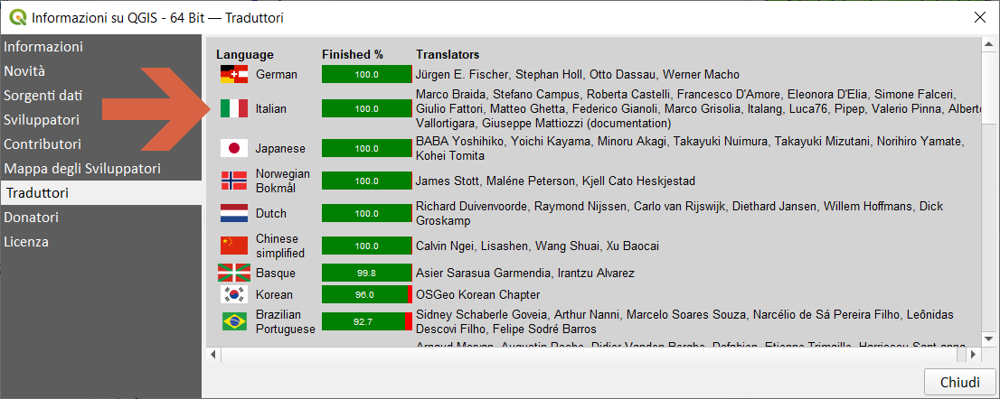

---
tags:
  - traduzione
  - GUI
  - interfaccia
  - versione
---

# Traduzione 
 
La descrizione delle funzioni in italiano è stata realizzata dal gruppo di traduttori diretti da [Stefano Campus](https://twitter.com/skampus1967?lang=it)

Marco Braida, Stefano Campus, Roberta Castelli, Francesco D'Amore, Eleonora D'Elia, Simone Falceri, Giulio Fattori, Matteo Ghetta, Federico Gianoli, Marco Grisolia, Italang, Luca76, Pipep, Valerio Pinna, Alberto Vallortigara, Salvatore Fiandaca (reporter)*, Giuseppe Mattiozzi (documentation)

## QGIS LTR

## QGIS corrente

## QGIS dev 

\* [PR](https://github.com/qgis/QGIS/pull/44302/commits/e28a18a85c417b52f4768972ec4484ae11e56abe)

## Gruppo Telegram Traduttori

- <https://t.me/qgis_it_traduzione>
